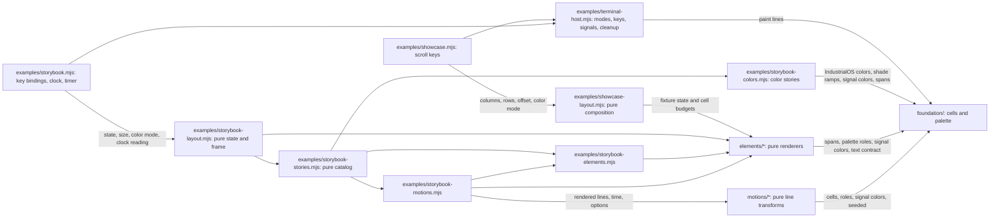

# Architecture

This is the design system's architecture. Paths are relative to `design-system/` unless they start with `../`. The project map, dependency direction between projects, and where new projects go are in the [root architecture](../../docs/architecture.md); the repository-wide mission, design, and conventions are at the root too.

Status: native showcase and terminal storybook. The design system's own engineering rules are in [conventions](conventions.md) and its experience in [design](design.md). Thirteen elements, their shared foundation (including the IndustrialOS color data and shade ramps, the signal colors, and seeded randomness), nineteen motion primitives, the all-at-once showcase, and the storybook are implemented as plain Node.js 22 ES modules with no dependencies. They form the private package `@industrial-os/design-system`, which this repository's projects may import by name and which is never published ([decision](../../docs/decisions/in-repo-design-system-package.md)). Both Pi extensions now consume exported subpaths through host adapters; its contracts remain private and not a stable API.

Evidence: design-system inventory with canonical Markdown guidance, `foundation/`, thirteen folders under `elements/`, `motions/`, `examples/`, `package.json` with its exports map, and colocated `node --test` checks including `package.test.mjs`. There is no release or CI.

## System and module map

### Current contents

| Path | Purpose | Public entry point | Dependencies |
| --- | --- | --- | --- |
| `README.md` | Design-system orientation and release status | Design-system landing page | Links to canonical guides |
| `AGENTS.md`, `CLAUDE.md` | Design-system reading routes, supplementing the root guide | AGENTS; CLAUDE imports it | Root agent guide and its supporting-document map |
| `CONTRIBUTING.md` | Setup, commands, and checks | Contributor workflow | Git, Node 22 |
| `package.json` | Private package `@industrial-os/design-system`: ESM, Node 22 or newer, no dependencies, scripts, or `main`; the `exports` map | `@industrial-os/design-system/<foundation, elements, or motions>/<name>`, by package name | None |
| `package.test.mjs` | Package shape and exports-map checks | `node --test` | `package.json`, every exported module, `node:fs` |
| `docs/architecture.md` | Placement, boundaries, and evolution | This guide | Current inventory |
| `docs/conventions.md` | Design-system stack, package exports, text contract, palette source, and performance rules | Rules, examples, and checks | Repository-wide conventions |
| `docs/design.md` | The design system's element set, reference colors, motions, and storybook | Design rules within the shared language | Repository-wide design |
| `foundation/` | The Acid / Black palette values this project owns, line model, text/glyph contract with the curated `GLYPHS`, role-or-RGB painting and `resolveColor()`, IndustrialOS colors and derived shade ramps, status-bar's signal colors with `mixOver()` and the Herdr chrome colors, and seeded randomness | `palette.mjs`, `cells.mjs`, `industrialos-colors.mjs`, `signal-colors.mjs`, `seeded.mjs`; [README](../foundation/README.md) | Node standard library |
| `elements/label-plate/` | Informational label plate, capped or slab | `labelPlate()`; [README](../elements/label-plate/README.md) | `foundation/` |
| `elements/numbered-panel/` | Numbered, bounded frame | `numberedPanel()`, `panelInnerWidth()`; [README](../elements/numbered-panel/README.md) | `foundation/`, label plate |
| `elements/instrument-frame/` | status-bar's framed footer geometry | `instrumentFrame()`, `frameGeometry()`, `frameStubs()`, `frameCenter()`, `wrapLine()`; [README](../elements/instrument-frame/README.md) | `foundation/` |
| `elements/count-plate/` | Exact count plate (CMP, AU) | `countPlate()`, `COUNT_PLATES`; [README](../elements/count-plate/README.md) | `foundation/` |
| `elements/mode-plate/` | Inline mode plate (PNYTL) | `modePlate()`, `pnytlPlate()`, `modePlateParts()`, `pnytlPlateParts()`; [README](../elements/mode-plate/README.md) | `foundation/` |
| `elements/state-chip/` | Supplied-state chips (Tatsu) | `stateChip()`, `stateChips()`, `stateChipParts()`; [README](../elements/state-chip/README.md) | `foundation/` |
| `elements/lamp/` | One-cell root lamp | `lamp()`, `LAMP_BLINK`, `LAMP_DIM_STYLE`; [README](../elements/lamp/README.md) | `foundation/` |
| `elements/status-row/` | Label/value/state row | `statusRow()`; [README](../elements/status-row/README.md) | `foundation/` |
| `elements/gauge/` | Calibrated value reading, with opt-in zones and a tick-free scale | `gauge()`, `gaugeScale()`, `gaugeReading()`, `gaugeTrack()`, `gaugeParts()`, `gaugeScaleParts()`, `gaugeTick()`, `gaugeExtent()`, `gaugeZone()`, `READOUT_CHIP`; [README](../elements/gauge/README.md) | `foundation/` |
| `elements/pixel-numeral/` | Half-block pixel numeral and its reconstruction | `pixelNumeral()`, `numeralGrid()`, `numeralLines()`, `numeralAt()`; [README](../elements/pixel-numeral/README.md) | `foundation/` |
| `elements/segment-meter/` | USG quota squares and provider columns, with time formatters | `segmentMeter()`, `providerColumn()`, `providerColumnParts()`, `litSegments()`, `countdown()`, `staleAge()`; [README](../elements/segment-meter/README.md) | `foundation/` |
| `elements/thread-rail/` | Lamp, ROOT plate, unit marks, and AU badge | `threadRail()`, `threadRailPieces()`, `threadRailSpans()`, `unitMarks()`; [README](../elements/thread-rail/README.md) | `foundation/`, lamp, label plate, count plate |
| `elements/transcript-marker/` | claude-interrupt's DIRECTIVE UPDATED marker as static pieces | `transcriptMarker()`, `markerPlate()`, `markerBars()`, `MARKER_TIMELINE`; [README](../elements/transcript-marker/README.md) | `foundation/` |
| `motions/` | Pure line transforms at an explicit time: scan, pulse, reveal, draw-in, warm-up, latch, beacon, cycle, fade, blink, flash, ping, wipe, fill-in, burn-out, edge pulse, restrike, ghost, nudge, on the shared `frame.mjs` | One file per motion with its function, `*_DEFAULTS`, a duration helper when finite, and host phase helpers `blinkOn()`/`nudgeOffset()`; [README](../motions/README.md) | `foundation/` |
| `examples/showcase-layout.mjs` | Pure composition of the first four elements with labeled fixtures | `composeShowcase()`, `viewport()` | `foundation/`, elements |
| `examples/showcase.mjs` | Showcase host: options, snapshot, scroll keys | `node examples/showcase.mjs` | Layout, terminal host, `node:util`, `node:url` |
| `examples/storybook-stories.mjs` | Pure story catalog in index order | `STORIES`, `canPlay()`, `motionParameters()`; [README](../examples/README.md) | Element, motion, and color stories; usage |
| `examples/storybook-elements.mjs` | Pure element stories from the real renderers | `ELEMENT_STORIES` | `foundation/`, elements, usage |
| `examples/storybook-motions.mjs` | Pure motion stories, the composed marker timeline, and each example's redraw interval | `MOTION_STORIES`, `CONTINUOUS_FRAME_MS` | `foundation/`, elements, motions, element stories, usage |
| `examples/storybook-colors.mjs` | Pure COLORS and SIGNAL COLORS stories | `COLOR_STORY`, `HUE_GROUPS`, `SIGNAL_STORY`, `SIGNAL_GROUPS` | `foundation/` |
| `examples/storybook-usage.mjs` | Pure usage-text builder | `call()`, `literal()`, `code()`, `spread()` | None |
| `examples/storybook-layout.mjs` | Pure browsing state, key actions, sections, scrolling index, and frame composition | `initialState()`, `press()`, `advance()`, `needsTimer()`, `playbackInterval()`, `composeStorybook()`, `SECTIONS`, `REPLAY_PAUSE_MS` | Stories, motion stories, `foundation/`, label plate, numbered panel |
| `examples/storybook.mjs` | Storybook host: options, snapshot, key bindings, playback clock, the redraw timer | `node examples/storybook.mjs` | Layout, terminal host, `node:perf_hooks`, `node:timers`, `node:util`, `node:url` |
| `examples/terminal-mouse.mjs` | Bounded SGR cell mouse accumulator at Node's decoded-key seam, without timers | `mouseDecoder()` | None |
| `examples/terminal-host.mjs` | Shared terminal session for both hosts: modes, key decoder, listeners, cleanup | `runTerminal()`, `sizeOption()`, `colorMode()` | `foundation/`, terminal mouse, `node:readline`, `node:stream` |

Rendering is terminal text in cells with terminal-native styling only, and Herdr is the primary target. There is no browser presentation layer. The bounded Herdr 0.9.3 checks are recorded separately for the [showcase](../CONTRIBUTING.md#native-verification-baseline) and [storybook](../CONTRIBUTING.md#storybook-verification-status).

### Dependency direction

Arrows point from a module to the modules it imports or calls. Inside `elements/`, two elements compose others through their public functions: the numbered panel uses the label plate, and the thread rail uses the lamp, label plate, and count plate. No other element imports an element, and there are no cycles; the rule is in [conventions](conventions.md#module-and-dependency-rules). The storybook's usage builder (`storybook-usage.mjs`) is imported by the element and motion stories and imports nothing. Only the live storybook supplies `onClick()` to the shared session, enabling normal tracking 1000 and SGR cell reports 1006; cleanup disables both. The bounded `terminal-mouse.mjs` accumulator consumes packets before their digits can become keys. The showcase and snapshots never opt in. Click scope and keyboard fallback are owned by [examples](../examples/README.md#left-clicks).

Other projects enter only through the `exports` map in `package.json`, by package name: every foundation module, element, and motion primitive is exported, and `examples/`, the tests, and `motions/frame.mjs` are not. The design system imports nothing from another project. The rule for importers is in the [root conventions](../../docs/conventions.md#module-and-dependency-rules).

Diagram notation follows [Mermaid flowchart syntax](https://mermaid.js.org/syntax/flowchart.html); no renderer is installed here.

## Representative flows

**Snapshot:** `node examples/showcase.mjs --plain --columns 80` parses options with `util.parseArgs` and composes every line at exactly 80 cells. It paints without escapes and exits 0. Invalid options or dimensions print usage and exit 2. A non-terminal stdout always takes this path, so piping never hangs.

**Live view:** with terminal stdin and stdout, the shared terminal host enters the alternate screen, hides the cursor, and enables raw mode. It repaints every row at an absolute position in one write per frame. The showcase redraws only on `resize` or a scroll key. Node's key decoder buffers fragmented escape sequences on an owned PassThrough stream, which is disposed with the input listener. Quit keys, SIGINT, SIGTERM, SIGHUP, and drawing errors all run the same cleanup: reset style, show the cursor, leave the alternate screen, restore cooked mode, and remove listeners. A synchronous `exit` listener is the last resort. Unexpected failures print their cause and exit 1, never a success-shaped screen.

**Storybook:** `node examples/storybook.mjs` uses the same session. Keys, as decoded by Node, and optional unmodified left clicks on layout-generated visible targets map to the same `press()` actions on pure browsing state; the host redraws only when an action changes it, or on resize. While the storybook-wide motion setting is on, selecting a motion preview starts playback at the current clock reading. The host keeps one interval at `playbackInterval(state)`, the preview's own step (67 ms for a continuously changing motion), whenever `needsTimer(state)` holds, and restarts it when the step changes. Each tick asks `advance()` whether a finite preview has reached its motion's duration helper, or whether a completed one has waited `REPLAY_PAUSE_MS` to replay, then redraws a frame composed for the current clock reading; a waiting tick that changes nothing draws nothing. Pause, turning motion off with `o`, selecting a still story, the key list, and every exit path clear the interval. Without color, previews whose frames would not change do not start. Non-terminal output and `--plain` print the first story once and exit.

Elements and motions do not own files, network requests, model turns, clocks, timers, or global keybindings. Interaction and time belong to a host; the elements themselves are not interactive.

## Data and contracts

Element inputs, states, invalid-input outcomes, and width behavior are documented in each element README. Shared rules are in [foundation](../foundation/README.md):

- Every block renderer returns lines of exactly its `width` (1–1000 cells). Inline pieces (plates, chips, the lamp, a segment meter) return spans no wider than their `maxWidth` for the caller to place. Spans carry palette roles, literal `#RRGGBB` values from `signal-colors.mjs` where an element models an extension color, or the reserved `'default'` to keep a terminal channel (claude-interrupt's transparent cells); omitting a color still means secondary text on the field; the color stories' swatches carry literal values from `industrialos-colors.mjs` and `signal-colors.mjs`.
- Caller text is shown as printable ASCII, with every other code point replaced by `?`. Structural glyphs come from one curated set that must render one cell wide.
- Unknown values stay distinct from zero. Invalid numbers and dimensions throw rather than being clamped.
- Color output is 24-bit SGR from `palette.mjs` roles or validated literal `#RRGGBB` values. Plain output has the same cells without escapes.
- IndustrialOS colors are a reference collection, not a theme. Their derived ramp steps are generated, and are labeled so wherever they are shown.
- Signal colors are status-bar's product colors, owned here and imported by status-bar through exported subpaths. `HERDR_CHROME`, in the same module, holds the Herdr theme's two chrome colors that are neither roles nor status-bar colors; `herdr/test/` imports it by package name. They are not roles: state colors stay role names so motions can recognise warning and critical cells.
- Motions take `lines` and options and return new lines with the same cells; seeded motions take an integer `seed` and draw from `seeded.mjs`, so the same seed gives the same frames.

The package's public surface is its `exports` map. Each subpath, `./foundation/<name>`, `./elements/<name>`, or `./motions/<name>`, maps to one module file, and that module's README or section is its contract. Tests, `examples/`, and the `motions/frame.mjs` seam are not exported. Modules with TypeScript consumers ship colocated `.d.mts` declarations, resolved through the same export targets. No token schema or storage exists.

## Critical invariants

| Must remain true | Current home | Check or gap |
| --- | --- | --- |
| Only polished, public-safe material belongs here | Mission and contributing | Publication review |
| One canonical definition per rule, command, or palette value | AGENTS, canonical guides, `foundation/palette.mjs`, `foundation/industrialos-colors.mjs`, `foundation/signal-colors.mjs` | Link/map and duplication review; the color stories' tests read every displayed value from `industrialos-colors.mjs` and `signal-colors.mjs`. These files are the source of the colors; both current extensions import them. Any future mirror still requires review comparison until migration. |
| Every foundation module, element, and motion primitive is exported by package name, and nothing else is | `package.json` | `node --test`: `package.test.mjs` |
| Displayed data is not falsified by layout, rounding, or fallback | Gauge and status-row contracts | `node --test`: fills and readouts never overstate; unknown is never zero |
| Output respects cell budgets and safe display text | `foundation/cells.mjs` | `node --test`: widths 1–160 and short heights; control and Unicode injection. Native Herdr frame and glyph-ruler checks are recorded in Contributing. |
| Terminal modes are always restored | `examples/terminal-host.mjs` | `node --test`, isolated real-PTY lifecycle checks for both hosts, and actual Herdr exit checks of both hosts; mouse support and an earlier version of the Colors story also have native Herdr injected-report checks, not physical-pointer verification, and the current Colors page has not been re-checked natively; see Contributing |
| Motion is bounded and deterministic, and never alters state cells unless it opts in and keeps their cue | `motions/`, `motions/frame.mjs`, and `examples/storybook.mjs` | `node --test`: frames at explicit times, any positive period with motion-off settling it, warning/critical exemption and the opt-in guard, seeded determinism, finite previews completing at their duration helper, each preview's redraw interval, one timer only while playing or waiting to replay, cleared on every exit path. The isolated real-PTY frame-rate and native Herdr playback checks in Contributing cover scan, pulse, and reveal only, not the newer motions; neither is a performance baseline. |

## Where the next change belongs

To refine a gauge:
1. Update `elements/gauge/README.md` and `gauge.mjs` together, with a failing check in `gauge.test.mjs` first.
2. Keep it I/O-free. Hosts supply values and cell budgets.
3. Add shared behavior to `foundation/` only when a second element needs the same semantics.
4. Update the showcase fixtures and the gauge story in `examples/storybook-elements.mjs` if its specimen states change, and check them in Herdr.

A new element gets its own `elements/<element-name>/` folder with README, code, and test, and an `./elements/<element-name>` entry in the `exports` map of `package.json`; a new foundation module or motion primitive gets its entry too, and `package.test.mjs` fails until it has one. Map the README in the [root AGENTS](../../AGENTS.md#supporting-documents), then add its story as described in [examples](../examples/README.md#adding-to-the-storybook). A new motion follows the extension rules in [motions](../motions/README.md#extending).

## Evolution and known limits

- Element and motion functions are first-pass contracts, not a released API. When one changes, update its README, callers, showcase, storybook story, and checks together; do not silently repurpose an input or palette role.
- The second element set and the newer motions are consumed by both Pi extensions through exported subpaths and their own host adapters. Each element README records opt-in pieces and remaining default-reference differences. Colors are owned/imported here; Pi text measurement, emission, layout and timing stay host-owned. status-bar retains legacy state-hiding warm-up/row-boot compatibility effects rather than weakening the DS guard; see [its seam](../../pi/status-bar/docs/architecture.md#design-system-rendering-seam). No native Herdr check is implied.
- An extension sequence that no single motion expresses is composed by a host from several motions, as the storybook's marker timeline is; add a motion only when a sequence needs a frame rule that composition cannot give.
- The text contract is deliberately narrow. Supporting multilingual or emoji text requires a cell-measurement decision, and possibly a dependency; ask first.
- There are no 256-color, 16-color, or ASCII-glyph fallbacks. Add one when a target terminal needs it.
- Successful testing in Herdr would not establish compatibility with every other terminal or multiplexer. Record the tested scope.
- No measured need justifies multiple packages, a renderer abstraction, a general animation engine, a story registry or discovery CLI, a backend, or a release service. The terminal host is shared because two real entry points use it. The storybook's index scrolls rather than paging into a separate catalog; revisit only if browsing by section and scrolling stops being enough.

## Technical decisions

The package and color ownership are recorded at the root in [the in-repo design-system package](../../docs/decisions/in-repo-design-system-package.md). No project-level decision records exist yet. The confirmed product direction is in [mission](../../docs/mission.md) and [design](../../docs/design.md). Add a record under `docs/decisions/` only for a consequential choice with alternatives and a revisit condition; map each record directly in AGENTS.
