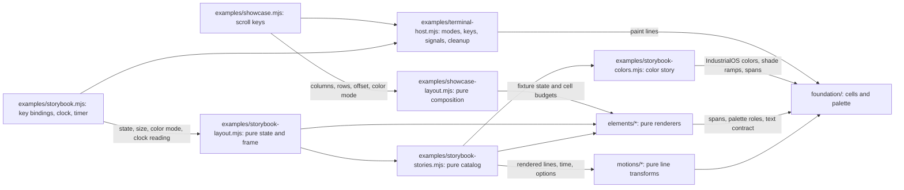

# Architecture

This is the design system's architecture. Paths are relative to `design-system/` unless they start with `../`. The project map, dependency direction between projects, and where new projects go are in the [root architecture](../../docs/architecture.md); the repository-wide mission, design, and conventions are at the root too.

Status: native showcase and terminal storybook. The design system's own engineering rules are in [conventions](conventions.md) and its experience in [design](design.md). The four selected elements, their shared foundation (including the IndustrialOS color data and shade ramps), three motion primitives, the all-at-once showcase, and the storybook are implemented as plain Node.js 22 ES modules with no dependencies. Nothing is released; module paths are not a stable public API.

Evidence: design-system inventory with canonical Markdown guidance, `foundation/`, four folders under `elements/`, `motions/`, `examples/`, and colocated `node --test` checks. There is no package manifest, release, or CI.

## System and module map

### Current contents

| Path | Purpose | Public entry point | Dependencies |
| --- | --- | --- | --- |
| `README.md` | Design-system orientation and release status | Design-system landing page | Links to canonical guides |
| `AGENTS.md`, `CLAUDE.md` | Design-system reading routes, supplementing the root guide | AGENTS; CLAUDE imports it | Root agent guide and its supporting-document map |
| `CONTRIBUTING.md` | Setup, commands, and checks | Contributor workflow | Git, Node 22 |
| `docs/architecture.md` | Placement, boundaries, and evolution | This guide | Current inventory |
| `docs/conventions.md` | Design-system stack, text contract, palette mirror, and performance rules | Rules, examples, and checks | Repository-wide conventions |
| `docs/design.md` | The design system's element set, reference colors, motions, and storybook | Design rules within the shared language | Repository-wide design |
| `foundation/` | Acid / Black palette values mirrored from the Pi extensions, line model, text/glyph contract, role-or-RGB painting, IndustrialOS colors and derived shade ramps | `palette.mjs`, `cells.mjs`, `industrialos-colors.mjs`; [README](../foundation/README.md) | Node standard library |
| `elements/label-plate/` | Informational label plate | `labelPlate()`; [README](../elements/label-plate/README.md) | `foundation/` |
| `elements/numbered-panel/` | Numbered, bounded frame | `numberedPanel()`, `panelInnerWidth()`; [README](../elements/numbered-panel/README.md) | `foundation/`, label plate |
| `elements/gauge/` | Calibrated value reading | `gauge()`, `gaugeScale()`, `gaugeReading()`; [README](../elements/gauge/README.md) | `foundation/` |
| `elements/status-row/` | Label/value/state row | `statusRow()`; [README](../elements/status-row/README.md) | `foundation/` |
| `motions/` | Pure scan, pulse, and reveal line transforms at an explicit time | `scan()`, `pulse()`, `reveal()`, `revealDuration()`; [README](../motions/README.md) | `foundation/` |
| `examples/showcase-layout.mjs` | Pure composition of all four elements with labeled fixtures | `composeShowcase()`, `viewport()` | `foundation/`, elements |
| `examples/showcase.mjs` | Showcase host: options, snapshot, scroll keys | `node examples/showcase.mjs` | Layout, terminal host, `node:util`, `node:url` |
| `examples/storybook-stories.mjs` | Pure story catalog: element states and motion examples from the real renderers and motions, then the color story | `STORIES`, `canPlay()`, `motionParameters()`; [README](../examples/README.md) | `foundation/`, elements, motions, color story |
| `examples/storybook-colors.mjs` | Pure COLORS story: IndustrialOS colors by hue, and their shade ramps | `COLOR_STORY`, `HUE_GROUPS` | `foundation/` |
| `examples/storybook-layout.mjs` | Pure browsing state, key actions, and frame composition | `initialState()`, `press()`, `advance()`, `composeStorybook()` | Stories, `foundation/`, label plate, numbered panel |
| `examples/storybook.mjs` | Storybook host: options, snapshot, key bindings, playback clock, the redraw timer | `node examples/storybook.mjs` | Layout, terminal host, `node:perf_hooks`, `node:timers`, `node:util`, `node:url` |
| `examples/terminal-mouse.mjs` | Bounded SGR cell mouse accumulator at Node's decoded-key seam, without timers | `mouseDecoder()` | None |
| `examples/terminal-host.mjs` | Shared terminal session for both hosts: modes, key decoder, listeners, cleanup | `runTerminal()`, `sizeOption()`, `colorMode()` | `foundation/`, terminal mouse, `node:readline`, `node:stream` |

Rendering is terminal text in cells with terminal-native styling only, and Herdr is the primary target. There is no browser presentation layer. The bounded Herdr 0.9.3 checks are recorded separately for the [showcase](../CONTRIBUTING.md#native-verification-baseline) and [storybook](../CONTRIBUTING.md#storybook-verification-status).

### Dependency direction

Arrows point from a module to the modules it imports or calls. Only the live storybook supplies `onClick()` to the shared session, enabling normal tracking 1000 and SGR cell reports 1006; cleanup disables both. The bounded `terminal-mouse.mjs` accumulator consumes packets before their digits can become keys. The showcase and snapshots never opt in. Click scope and keyboard fallback are owned by [examples](../examples/README.md#left-clicks).

The only cross-element import is the numbered panel's use of the label plate's public function. Motions import only `foundation/`; elements never import motions. Diagram notation follows [Mermaid flowchart syntax](https://mermaid.js.org/syntax/flowchart.html); no renderer is installed here.

## Representative flows

**Snapshot:** `node examples/showcase.mjs --plain --columns 80` parses options with `util.parseArgs` and composes every line at exactly 80 cells. It paints without escapes and exits 0. Invalid options or dimensions print usage and exit 2. A non-terminal stdout always takes this path, so piping never hangs.

**Live view:** with terminal stdin and stdout, the shared terminal host enters the alternate screen, hides the cursor, and enables raw mode. It repaints every row at an absolute position in one write per frame. The showcase redraws only on `resize` or a scroll key. Node's key decoder buffers fragmented escape sequences on an owned PassThrough stream, which is disposed with the input listener. Quit keys, SIGINT, SIGTERM, SIGHUP, and drawing errors all run the same cleanup: reset style, show the cursor, leave the alternate screen, restore cooked mode, and remove listeners. A synchronous `exit` listener is the last resort. Unexpected failures print their cause and exit 1, never a success-shaped screen.

**Storybook:** `node examples/storybook.mjs` uses the same session. Keys, as decoded by Node, and optional unmodified left clicks on layout-generated visible targets map to the same `press()` actions on pure browsing state; the host redraws only when an action changes it, or on resize. `p` starts playback: the host records a clock reading and starts one 67 ms interval. Each tick asks `advance()` whether a finite reveal is complete, then redraws a frame composed for the current clock reading. Pause, completion, story or example changes, the key list, and every exit path clear the interval. Without color, previews whose frames would not change do not start. Non-terminal output and `--plain` print the first story once and exit.

Elements and motions do not own files, network requests, model turns, clocks, timers, or global keybindings. Interaction and time belong to a host; the elements themselves are not interactive.

## Data and contracts

Element inputs, states, invalid-input outcomes, and width behavior are documented in each element README. Shared rules are in [foundation](../foundation/README.md):

- Every renderer returns lines of exactly its `width` (1–1000 cells), built from spans that carry palette roles. The color story's swatches carry literal `#RRGGBB` values from `industrialos-colors.mjs` instead.
- Caller text is shown as printable ASCII, with every other code point replaced by `?`. Structural glyphs come from one curated set that must render one cell wide.
- Unknown values stay distinct from zero. Invalid numbers and dimensions throw rather than being clamped.
- Color output is 24-bit SGR from `palette.mjs` roles or validated literal `#RRGGBB` values. Plain output has the same cells without escapes.
- IndustrialOS colors are a reference collection, not a theme. Their derived ramp steps are generated, and are labeled so wherever they are shown.

No token schema, storage, or package export exists.

## Critical invariants

| Must remain true | Current home | Check or gap |
| --- | --- | --- |
| Only polished, public-safe material belongs here | Mission and contributing | Publication review |
| One canonical definition per rule, command, or palette value | AGENTS, canonical guides, `foundation/palette.mjs`, `foundation/industrialos-colors.mjs` | Link/map and duplication review; the color story's tests read every displayed value from `industrialos-colors.mjs` |
| Displayed data is not falsified by layout, rounding, or fallback | Gauge and status-row contracts | `node --test`: fills and readouts never overstate; unknown is never zero |
| Output respects cell budgets and safe display text | `foundation/cells.mjs` | `node --test`: widths 1–160 and short heights; control and Unicode injection. Native Herdr frame and glyph-ruler checks are recorded in Contributing. |
| Terminal modes are always restored | `examples/terminal-host.mjs` | `node --test`, isolated real-PTY lifecycle checks for both hosts, and actual Herdr exit checks of both hosts; mouse support and an earlier version of the Colors story also have native Herdr injected-report checks, not physical-pointer verification, and the current Colors page has not been re-checked natively; see Contributing |
| Motion is bounded, deterministic, and never alters state cells | `motions/` and `examples/storybook.mjs` | `node --test`: frames at explicit times, any positive period with motion-off settling it, warning/critical exemption, one timer only while playing, cleared on every exit path. Isolated real-PTY frame-rate check; bounded native Herdr playback checks, not a performance baseline. |

## Where the next change belongs

To refine a gauge:
1. Update `elements/gauge/README.md` and `gauge.mjs` together, with a failing check in `gauge.test.mjs` first.
2. Keep it I/O-free. Hosts supply values and cell budgets.
3. Add shared behavior to `foundation/` only when a second element needs the same semantics.
4. Update the showcase fixtures and the gauge story in `examples/storybook-stories.mjs` if its specimen states change, and check them in Herdr.

A new element gets its own `elements/<element-name>/` folder with README, code, and test. Map the README in the [root AGENTS](../../AGENTS.md#supporting-documents), then add its story as described in [examples](../examples/README.md#adding-to-the-storybook). A new motion follows the extension rules in [motions](../motions/README.md#extending).

## Evolution and known limits

- Element and motion functions are first-pass contracts, not a released API. When one changes, update its README, callers, showcase, storybook story, and checks together; do not silently repurpose an input or palette role.
- The text contract is deliberately narrow. Supporting multilingual or emoji text requires a cell-measurement decision, and possibly a dependency; ask first.
- There are no 256-color, 16-color, or ASCII-glyph fallbacks. Add one when a target terminal needs it.
- Successful testing in Herdr would not establish compatibility with every other terminal or multiplexer. Record the tested scope.
- No measured need justifies multiple packages, a renderer abstraction, a general animation engine, a story registry or discovery CLI, a backend, or a release service. The terminal host is shared because two real entry points use it.

## Technical decisions

No technical decision records exist yet. The confirmed product direction is in [mission](../../docs/mission.md) and [design](../../docs/design.md). Add a record under `docs/decisions/` only for a consequential choice with alternatives and a revisit condition; map each record directly in AGENTS.
