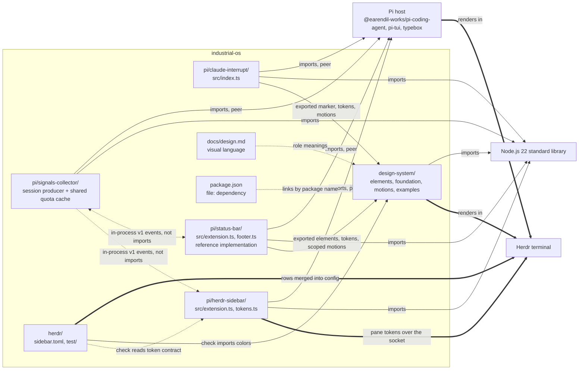

# Architecture

This is the architecture of the monorepo: which projects it holds, how they relate, and where the next one goes. Each project has its own architecture guide for its internals; this guide does not repeat them.

Status: current repository at the revision that added `pi/signals-collector/`, `pi/herdr-sidebar/` and `herdr/`.
Evidence: the full source tree of `design-system/` and `pi/claude-interrupt/`, every import statement across the projects, their manifests and test commands, the root `package.json` and lockfile, `design-system/package.test.mjs`, the guides of `pi/status-bar/`, and the Git history of the moves of claude-interrupt and status-bar. The signals-collector, herdr-sidebar and Herdr configuration rows add their full source, tests and imports. No dependency graph was inferred from folder names.

## Projects

Industrial OS is one repository holding several independent projects. A project is a folder that owns its language, toolchain, dependencies, checks, and guides. Today there are six. They share code only through the design-system package. claude-interrupt and status-bar consume exported subpaths through their own Pi adapters, and the Herdr configuration's check imports its colors. Displays receive session data from signals-collector through in-process events, never imports.

| Project | Language and runtime | Public entry point | Dependencies | Guides |
| --- | --- | --- | --- | --- |
| `design-system/` | Plain Node.js 22 ES modules (`.mjs`), standard library only; a private `package.json` with an `exports` map and no dependencies or scripts | `@industrial-os/design-system/<foundation, elements, or motions>/<name>`, by package name inside this repository only; `node examples/storybook.mjs`, `node examples/showcase.mjs`. Never published; the module contracts are first-pass, not a stable API | None outside Node | [README](../design-system/README.md), [AGENTS](../design-system/AGENTS.md), [architecture](../design-system/docs/architecture.md), [conventions](../design-system/docs/conventions.md), [design](../design-system/docs/design.md), [contributing](../design-system/CONTRIBUTING.md) |
| `pi/claude-interrupt/` | TypeScript ES modules run by Node 22 type stripping; npm; `tsc --noEmit` | `package.json` `pi.extensions` → `src/index.ts`, loaded by the Pi host | Host-provided Pi packages as peer dependencies; development dependencies pin Pi 0.99.1. Imports exported design-system marker/token/motion subpaths through a Pi adapter | [README](../pi/claude-interrupt/README.md), [AGENTS](../pi/claude-interrupt/AGENTS.md), [architecture](../pi/claude-interrupt/docs/architecture.md), [contributing](../pi/claude-interrupt/CONTRIBUTING.md) |
| `pi/status-bar/` | TypeScript ES modules run by Node 22 type stripping; npm scripts; no type check | `package.json` `pi.extensions` → `src/extension.ts`, loaded by the Pi host | Host-provided Pi/TUI packages as peer dependencies; no development dependencies, tests use the globally installed Pi. Imports exported design-system footer element/token/scoped-motion subpaths through a Pi adapter; consumed-subpath declarations have a compile-only specimen, not a standalone project typecheck | [README](../pi/status-bar/README.md), [AGENTS](../pi/status-bar/AGENTS.md), [architecture](../pi/status-bar/docs/architecture.md), [contributing](../pi/status-bar/CONTRIBUTING.md) |
| `pi/signals-collector/` | TypeScript ES modules, Node 22 type stripping, existing global Pi tests | Explicit Pi entry `src/extension.ts`; v1 in-process snapshot events and Active tool | Host Pi/TypeBox peers; Node standard library, no renderer or extension imports | [README](../pi/signals-collector/README.md), [AGENTS](../pi/signals-collector/AGENTS.md), [architecture](../pi/signals-collector/docs/architecture.md), [contributing](../pi/signals-collector/CONTRIBUTING.md) |
| `pi/herdr-sidebar/` | TypeScript ES modules run by Node 22 type stripping; npm scripts; no type check | `package.json` `pi.extensions` → `src/extension.ts`, loaded by the Pi host; its token contract in `docs/token-contract.md` | Host-provided Pi packages as peer dependencies; no development dependencies, tests use the globally installed Pi. Talks to Herdr over its local socket; does not import the design system | [README](../pi/herdr-sidebar/README.md), [AGENTS](../pi/herdr-sidebar/AGENTS.md), [architecture](../pi/herdr-sidebar/docs/architecture.md), [contributing](../pi/herdr-sidebar/CONTRIBUTING.md) |
| `herdr/` | TOML read by Herdr; a Node 22 check | `sidebar.toml`, merged by hand into Herdr's `config.toml` | Herdr's config schema; its check imports design-system palette and signal colors by package name and reads herdr-sidebar's token contract document | [README](../herdr/README.md), [AGENTS](../herdr/AGENTS.md), [architecture](../herdr/docs/architecture.md), [contributing](../herdr/CONTRIBUTING.md) |

`pi/` groups the Pi extensions and holds the rules they share: [its guide](../pi/AGENTS.md). `herdr/` holds Herdr configuration.

### Dependency direction

Solid arrows labelled imports are imports verified in source. Thick arrows are where a project's output is rendered at run time. Dotted arrows show root installation, the shared design language, collector event transport and the token-contract document the Herdr check reads, not imports. claude-interrupt and status-bar consume the root-linked design-system package by exported subpaths; signals-collector and herdr-sidebar render no colors and do not import it, and the Herdr configuration restates colors as values that its check imports and compares. `design-system/foundation/palette.mjs` owns the nine Acid / Black roles; `foundation/signal-colors.mjs` owns product tokens. status-bar's explicit `COLORS` aliases and Pi-converted `C`, and claude-interrupt's Pi adapter, import these values rather than copying them. Pi still owns Unicode measurement, ANSI emission and host timing; see [the decision](decisions/in-repo-design-system-package.md).

No project imports another project's code, with one exception: any project may import `@industrial-os/design-system` by package name through an exported subpath. The rule is in [conventions](conventions.md#module-and-dependency-rules). A Pi extension still loads from its own folder with the host's peer packages, and reaches the design system through the root install: Pi's git install runs `npm install` in the clone root, and a checkout needs the root `npm install` described in [contributing](../CONTRIBUTING.md#setup). The design system imports nothing from another project.

### Repository-wide documents

The root holds what every project shares and nothing else:

| Document | Owns |
| --- | --- |
| [docs/mission.md](mission.md) | Product intent, scope, and constraints for the whole repository |
| [docs/design.md](design.md) | The visual and interaction language every project renders |
| [docs/conventions.md](conventions.md) | Engineering rules that hold in every language and toolchain |
| This guide | The project map, dependency direction, and where new projects go |
| [CONTRIBUTING.md](../CONTRIBUTING.md) | The workflow for a change and the repository-wide checks; it routes to each project's own validation |
| [AGENTS.md](../AGENTS.md) | Critical rules and the complete map of every guide |
| `package.json` and `package-lock.json` | The Pi extensions' entry points in `pi.extensions`, so Pi can install them from git, and the one `file:design-system` dependency that links the design-system package; no workspaces or scripts |
| [docs/decisions/](decisions/) | Consequential choices with alternatives and revisit conditions |

A project's guides supplement these and never restate them; they link.

## Representative flows

**A change inside one project** starts from that project's `AGENTS.md`, is traced through that project's architecture, and is verified by that project's contributing sequence, then by the [repository-wide checks](../CONTRIBUTING.md#repository-wide-checks). For example, refining the gauge touches only `design-system/elements/gauge/` and the design-system storybook; adjusting the marker timing of claude-interrupt touches only `pi/claude-interrupt/src/index.ts`, its tests, and its design doc.

**A change to the visual language** starts in `docs/design.md`. If a color value changes, the design system owns it: `design-system/foundation/palette.mjs` or `signal-colors.mjs` changes first, then the constants of each extension that still mirrors the value, in separate commits in their own projects, each with its own checks. Both rendering extensions import their colors, so the manual-copy check is retired for them. A future extension that still mirrors values requires the same review comparison until migration.

**Moving a project in** follows [the Pi contributing guide](../pi/CONTRIBUTING.md#moving-an-extension-in): rewrite its history under its new path, merge with a merge commit, add its entry point to the root `package.json`, point its install and `repository` fields at the monorepo, give it the required project document set, and add its guides to the root map. claude-interrupt was moved this way in pull request #4, and status-bar the same way in the pull request that added `pi/status-bar/`.

## Contracts between the root and a project

Every project must provide:

- `README.md`: purpose, status, how to run or install it, and links to its guides.
- `AGENTS.md` and `CLAUDE.md`: the project's rules and routes, supplementing the root; `CLAUDE.md` is exactly `@AGENTS.md`.
- `CONTRIBUTING.md`: its toolchain, exact commands, validation sequence, and verification records.
- `docs/architecture.md`: its modules, dependency direction, flows, invariants, and evolution.
- `docs/conventions.md` with its own rules beyond the repository-wide ones, and `docs/design.md` with its own experience within the shared language. Every current project has them.
- `docs/mission.md` only when it has a product scope of its own beyond the repository's; claude-interrupt, status-bar and signals-collector have one, the design system does not.
- A license notice if it carries a license.
- For a Pi extension, its entry point in `pi.extensions` of the root `package.json`.
- If it imports the design system, the root `npm install` in its setup and checks that run from a checkout where it has run. It does not add the package to its own manifest.

Every project's guides must appear in the [root supporting-documents map](../AGENTS.md#supporting-documents) with a direct link.

## Critical invariants

| Must remain true | Relevant code or guide | Check |
| --- | --- | --- |
| No project imports another project's code, except the design-system package by name through an exported subpath | Every `import` in `design-system/` and `pi/*/src` | Review check: `grep -rn "from '\.\./\.\./" design-system pi/*/src` finds nothing that crosses a project root, and every `@industrial-os/design-system` import names an exported subpath; no automated boundary check exists |
| The package exports every foundation module, element, and motion primitive, and nothing else | `design-system/package.json` | `design-system/package.test.mjs` in the design system's `node --test` |
| A Pi extension loads from its own folder with the host's peer packages plus the linked design-system package | `pi/*/package.json`, the root `package.json` | Each extension's non-interactive load check in its contributing guide |
| Every element and demo is terminal text with terminal-native styling | Mission; each project's design or architecture | Review check; the design system's automated checks compare plain and color output |
| Displayed values are truthful: unknown is never zero, failure is never success-shaped | `design-system/elements/*`, `pi/claude-interrupt/src/index.ts`, `pi/status-bar/src/*`, `pi/herdr-sidebar/src/*` | Each project's tests for unknown and failure states |
| Color values are identical across projects, with the design system as the source | `design-system/foundation/palette.mjs`, `design-system/foundation/signal-colors.mjs`, `pi/status-bar/src/footer.ts`, `pi/claude-interrupt/src/index.ts`, `herdr/sidebar.toml`, design | Review exported token imports/alias maps against `palette.mjs` and `signal-colors.mjs`; design maps roles; `herdr/test/sidebar.test.mjs` checks every color in the Herdr configuration; compare manually only for an extension that still mirrors values |
| Every guide is mapped once, with one canonical home per rule | `AGENTS.md` | Repository-wide checks 2 and 3 |

## Where the next change belongs

**A new Pi extension** gets `pi/<name>/` with the full project document set when it has its own experience and product scope, as claude-interrupt, status-bar and signals-collector do. It keeps its own `package.json`, tests, and license. If it renders Acid / Black roles or reuses an element, it imports them from the design-system package by name rather than copying them, and follows the migration requirements in [the decision](decisions/in-repo-design-system-package.md#migrating-an-extension).

**A new design-system element** stays entirely inside `design-system/`, with an entry in its `exports` map; its placement is in [the design-system architecture](../design-system/docs/architecture.md#where-the-next-change-belongs). Its README is mapped from the root.

**Herdr configuration** goes in `herdr/`, one TOML file per piece with a check beside it; placement is in [its architecture](../herdr/docs/architecture.md#where-the-next-change-belongs). Its language and toolchain are its own; nothing at the root presumes Node.

**A change that spans projects**, such as a new palette role, is several changes: the design doc, the design system, then each extension that mirrors it, each in its own commit with its own checks.

## Evolution and known limits

- **Shared code between projects.** The design system is a private package that claude-interrupt and status-bar import by exported subpath through Pi adapters. Each extension migrates in its own change; the requirements, including type declarations for claude-interrupt's `tsc`, are in [the decision](decisions/in-repo-design-system-package.md#migrating-an-extension). Publishing it, or consumers outside this repository, are out of scope.
- **One command for the whole repository.** None exists. Each project has its own validation sequence, and a project in another language would not fit a root Node command. Revisit if a CI gate is added; a root script that calls each project's documented sequence would be the smallest form, and it must not presume a language. Recorded as [a decision](decisions/standalone-packages.md).
- **Palette drift.** The design system owns the colors in `design-system/foundation/palette.mjs` for the nine roles and `design-system/foundation/signal-colors.mjs` for status-bar's other product colors (count tiers, mode inks, gauge zones, warm-up steps, usage providers). claude-interrupt and status-bar import them, removing their copies and retiring their manual comparison rows; the Herdr configuration's check compares its restated values. A future mirroring extension still needs a review comparison until migration.
- **Herdr configuration is merged by hand.** Herdr has no config includes, so `herdr/` content reaches a user's config only by a manual merge; see [its README](../herdr/README.md#install).
- **License.** The repository has no license; claude-interrupt carries MIT from before its move, and status-bar, signals-collector and herdr-sidebar have none. Resolve when the repository is offered for reuse.

The collector is the only owner of TUI session signals and shared CodexBar cache. Displays use events, not imports; see [collection ownership](decisions/session-signals-collection.md).

## Technical decisions

- [Session signals have one collection owner](decisions/session-signals-collection.md)
- [The design system is an in-repo package and owns the colors](decisions/in-repo-design-system-package.md)
- [Standalone packages, no shared workspace](decisions/standalone-packages.md), superseded in part by the package decision
- [The Pi extensions' colors take precedence over the design-system palette](decisions/extension-colors-take-precedence.md), superseded by the package decision
