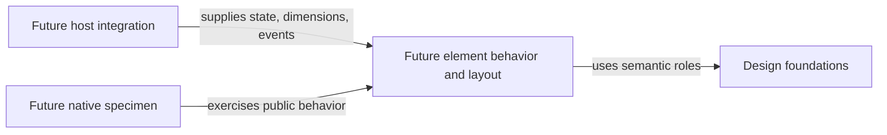

# Architecture

Status: documentation-only foundation. Proposed implementation boundaries below are explicitly **not implemented or approved as a final layout**.

Evidence: initial repository inventory on unborn `main`; eight canonical Markdown documents, a Git ignore file, and no application source, manifest, release, or CI.

## System and module map

### Current contents

| Path | Purpose | Public entry point | Dependencies |
| --- | --- | --- | --- |
| `README.md` | User orientation and release status | Repository landing page | Links to canonical guides |
| `AGENTS.md`, `CLAUDE.md` | Engineering reading routes | AGENTS; CLAUDE imports it | Direct supporting-document links |
| `CONTRIBUTING.md` | Setup and checks | Contributor workflow | Git and manual documentation review |
| `docs/mission.md` | Product boundaries | Goals and constraints | No runtime dependencies |
| `docs/design.md` | Visual and interaction specification | Design rules and acceptance criteria | No runtime dependencies |
| `docs/conventions.md` | Engineering baseline | Rules, examples, and checks | Links to architecture and contributing |
| `docs/architecture.md` | Placement and evolution | This guide | Current inventory and explicit proposals |

There is no runtime dependency graph yet.

### Proposed growth: one folder per polished element

Keep foundations in design until executable consumers need machine-readable tokens. Add `elements/<element-name>/` only when an element is selected and ready to curate. Its README would define usage, states, constraints, and acceptance; any implementation, specimen, and tests would live beside it.

An `examples/` area becomes useful only when a polished composition spans several elements. Do not create it, a package workspace, or host adapters in advance.

The proposed dependency direction is:

Arrows describe allowed dependency or input direction, not modules that already exist. Diagram notation follows [Mermaid flowchart syntax](https://mermaid.js.org/syntax/flowchart.html); no renderer is installed here.

## Representative flows

**Current change:** a design decision updates its canonical guide; contributing provides the review sequence; AGENTS keeps the reading route current. A broken local link or missing guide-map entry fails documentation review. No external service or storage is involved.

**Proposed native element:** a host supplies validated state and dimensions; the element lays out within that budget; the host presents it and routes input. Expected invalid/unsupported inputs receive a documented outcome. Unexpected host/I/O failures remain failures with their cause preserved, not a fabricated empty or successful state.

Interaction emits intent; the host handles any application operation and returns authoritative state. The element does not own files, network requests, model turns, or global keybindings.

## Data and contracts

Today the authoritative material is the canonical Markdown guidance. No token JSON schema, rendering API, storage schema, or package export is established.

For the first executable element, define its inputs, absent/error states, dimensions, interaction/focus contract, and supported terminal capabilities. Keep host-specific lifecycle outside reusable layout where that separation is useful; a plain function may be enough.

## Critical invariants

| Must remain true | Current home | Check or gap |
| --- | --- | --- |
| Only polished, public-safe material belongs here | Mission and contributing | Publication review |
| One canonical definition per rule or command | AGENTS and canonical guides | Link/map and duplication review |
| Displayed data is not falsified by motion or fallback | Design | Native checks not implemented |
| Output respects cell budgets and safe display text | Conventions | Width/Unicode/control-character checks not implemented |
| Interaction preserves the host's declared focus and state behavior | Design | Native input checks not implemented |

## Where the next change belongs

For a proposed gauge:
1. Settle its states, width behavior, and acceptance against design.
2. Add its specification at `elements/gauge/README.md` and map that guide in AGENTS.
3. If an executable specimen is approved, choose the smallest suitable native host and put its code and deterministic checks beside the element.
4. Reuse host width/terminal facilities rather than copying a browser exploration's approximations.
5. Add actual commands to contributing. Extract shared code only when another real consumer needs the same behavior.

This is a placement example, not approval to create a gauge or select a language.

## Evolution and known limits

- There are no public code contracts to maintain yet. Once introduced, document behavior changes and update consumers and checks together; do not silently repurpose a token or input.
- Move foundations to one machine-readable source only when executable consumers require it; remove duplicated authoritative values rather than maintaining parallel token tables.
- Keep replacements reversible with focused checks and small changes. Persistent-state migrations are inapplicable today.
- A single native host does not establish compatibility with every terminal or multiplexor. Record the tested scope.
- No measured need justifies multiple packages, a renderer abstraction, a backend, or a release service.

## Technical decisions

No technical decision records exist yet. The confirmed product direction is in [mission](mission.md) and [design](design.md). Add a record under `docs/decisions/` only for a consequential choice with alternatives and a revisit condition; map each record directly in AGENTS.
