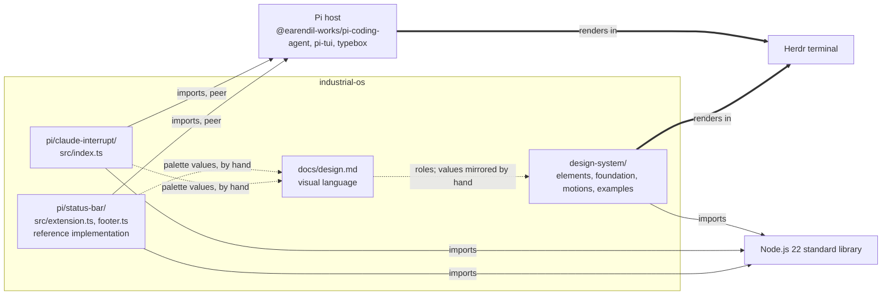

# Architecture

This is the architecture of the monorepo: which projects it holds, how they relate, and where the next one goes. Each project has its own architecture guide for its internals; this guide does not repeat them.

Status: current repository at the revision that moved status-bar in, with the planned Herdr home named as planned.
Evidence: the full source tree of `design-system/` and `pi/claude-interrupt/`, every import statement across all three projects, all three projects' manifests and test commands, the guides of `pi/status-bar/`, and the Git history of the moves of claude-interrupt and status-bar. No dependency graph was inferred from folder names.

## Projects

Industrial OS is one repository holding several independent projects. A project is a folder that owns its language, toolchain, dependencies, checks, and guides. Today there are three, and they do not share code.

| Project | Language and runtime | Public entry point | Dependencies | Guides |
| --- | --- | --- | --- | --- |
| `design-system/` | Plain Node.js 22 ES modules (`.mjs`), standard library only, no manifest | `node examples/storybook.mjs`, `node examples/showcase.mjs`; module paths are not a released API | None outside Node | [README](../design-system/README.md), [AGENTS](../design-system/AGENTS.md), [architecture](../design-system/docs/architecture.md), [conventions](../design-system/docs/conventions.md), [design](../design-system/docs/design.md), [contributing](../design-system/CONTRIBUTING.md) |
| `pi/claude-interrupt/` | TypeScript ES modules run by Node 22 type stripping; npm; `tsc --noEmit` | `package.json` `pi.extensions` → `src/index.ts`, loaded by the Pi host | Host-provided Pi packages as peer dependencies; development dependencies pin Pi 0.99.1 | [README](../pi/claude-interrupt/README.md), [AGENTS](../pi/claude-interrupt/AGENTS.md), [architecture](../pi/claude-interrupt/docs/architecture.md), [contributing](../pi/claude-interrupt/CONTRIBUTING.md) |
| `pi/status-bar/` | TypeScript ES modules run by Node 22 type stripping; npm scripts; no type check | `package.json` `pi.extensions` → `src/extension.ts`, loaded by the Pi host | Host-provided Pi packages and TypeBox as peer dependencies; no development dependencies, tests use the globally installed Pi | [README](../pi/status-bar/README.md), [AGENTS](../pi/status-bar/AGENTS.md), [architecture](../pi/status-bar/docs/architecture.md), [contributing](../pi/status-bar/CONTRIBUTING.md) |

`pi/` groups the Pi extensions and holds the rules they share: [its guide](../pi/AGENTS.md). `herdr/` is planned for Herdr configuration and does not exist.

### Dependency direction

Solid arrows labelled imports are imports verified in source. Thick arrows are where a project's output is rendered at run time. Dotted arrows are values carried by hand, from the extensions that own them to the design doc that names their roles and on to the design system's mirror: there is no import, build step, or package between projects. `pi/status-bar/src/footer.ts` declares all nine Acid / Black roles in its `C` palette, with colors of its own beside them; `pi/claude-interrupt/src/index.ts` declares five as constants; `design-system/foundation/palette.mjs` declares nine. The Pi extensions are the authority for those values and the design system mirrors them; see [the decision](decisions/extension-colors-take-precedence.md).

No project imports another. That is a rule, not an accident: a Pi extension is installed from its own folder by the Pi host and must load with nothing outside that folder, and the design system has no package to import. A shared module needs a decision on how an installed extension reaches it; see [Evolution](#evolution-and-known-limits).

### Repository-wide documents

The root holds what every project shares and nothing else:

| Document | Owns |
| --- | --- |
| [docs/mission.md](mission.md) | Product intent, scope, and constraints for the whole repository |
| [docs/design.md](design.md) | The visual and interaction language every project renders |
| [docs/conventions.md](conventions.md) | Engineering rules that hold in every language and toolchain |
| This guide | The project map, dependency direction, and where new projects go |
| [CONTRIBUTING.md](../CONTRIBUTING.md) | The workflow for a change and the repository-wide checks; it routes to each project's own validation |
| [AGENTS.md](../AGENTS.md) | Critical rules and the complete map of every guide |
| [docs/decisions/](decisions/) | Consequential choices with alternatives and revisit conditions |

A project's guides supplement these and never restate them; they link.

## Representative flows

**A change inside one project** starts from that project's `AGENTS.md`, is traced through that project's architecture, and is verified by that project's contributing sequence, then by the [repository-wide checks](../CONTRIBUTING.md#repository-wide-checks). For example, refining the gauge touches only `design-system/elements/gauge/` and the design-system storybook; adjusting the marker timing of claude-interrupt touches only `pi/claude-interrupt/src/index.ts`, its tests, and its design doc.

**A change to the visual language** starts in `docs/design.md`. If a palette value changes, the authority is the Pi extension that renders it; `design-system/foundation/palette.mjs` and the constants in each extension then change in separate commits in their own projects, each with its own checks. There is no mechanism that keeps them equal; the check is a review comparison of each extension's constants against `palette.mjs`, with the design doc mapping constants to roles.

**Moving a project in** follows [the Pi contributing guide](../pi/CONTRIBUTING.md#moving-an-extension-in): rewrite its history under its new path, merge with a merge commit, point its install and `repository` fields at the monorepo, give it the required project document set, and add its guides to the root map. claude-interrupt was moved this way in pull request #4, and status-bar the same way in the pull request that added `pi/status-bar/`.

## Contracts between the root and a project

Every project must provide:

- `README.md`: purpose, status, how to run or install it, and links to its guides.
- `AGENTS.md` and `CLAUDE.md`: the project's rules and routes, supplementing the root; `CLAUDE.md` is exactly `@AGENTS.md`.
- `CONTRIBUTING.md`: its toolchain, exact commands, validation sequence, and verification records.
- `docs/architecture.md`: its modules, dependency direction, flows, invariants, and evolution.
- `docs/conventions.md` with its own rules beyond the repository-wide ones, and `docs/design.md` with its own experience within the shared language. Every current project has them.
- `docs/mission.md` only when it has a product scope of its own beyond the repository's; claude-interrupt and status-bar have one, the design system does not.
- A license notice if it carries a license.

Every project's guides must appear in the [root supporting-documents map](../AGENTS.md#supporting-documents) with a direct link.

## Critical invariants

| Must remain true | Relevant code or guide | Check |
| --- | --- | --- |
| No project imports another project's code | Every `import` in `design-system/` and `pi/*/src` | Review check: `grep -rn "from '\.\./\.\./" design-system pi/*/src` finds nothing that crosses a project root; no automated boundary check exists |
| A Pi extension loads from its own folder with the host's peer packages only | `pi/*/package.json` | Each extension's non-interactive load check in its contributing guide |
| Every element and demo is terminal text with terminal-native styling | Mission; each project's design or architecture | Review check; the design system's automated checks compare plain and color output |
| Displayed values are truthful: unknown is never zero, failure is never success-shaped | `design-system/elements/*`, `pi/claude-interrupt/src/index.ts`, `pi/status-bar/src/*` | Each project's tests for unknown and failure states |
| Palette values are identical across projects, with the extensions as the authority | `pi/status-bar/src/footer.ts`, `pi/claude-interrupt/src/index.ts`, `design-system/foundation/palette.mjs`, design | Review comparison of the extension constants against `palette.mjs`; design maps roles; no automated check |
| Every guide is mapped once, with one canonical home per rule | `AGENTS.md` | Repository-wide checks 2 and 3 |

## Where the next change belongs

**A new Pi extension** gets `pi/<name>/` with the full project document set when it has its own experience and product scope, as claude-interrupt and status-bar do. It keeps its own `package.json`, tests, and license. If it renders Acid / Black roles, it declares them as named constants and joins the review comparison against `palette.mjs`. Nothing in `design-system/` changes unless the design doc changes.

**A new design-system element** stays entirely inside `design-system/`; its placement is in [the design-system architecture](../design-system/docs/architecture.md#where-the-next-change-belongs). Its README is mapped from the root.

**Herdr configuration** gets `herdr/` with the project document set when the first maintained content exists. Its language and toolchain are its own; nothing at the root presumes Node.

**A change that spans projects**, such as a new palette role, is several changes: the design doc, then each project in its own commit with its own checks.

## Evolution and known limits

- **Shared code between projects.** The design system is the reference kit the extensions imitate, not a dependency they import. Sharing an element implementation with an installed extension needs a decision on packaging: a published package, a copied module, or a generated file. Revisit when a second extension renders the same element as the design system and both change together; until then, copying values is the simpler correct choice.
- **One command for the whole repository.** None exists. Each project has its own validation sequence, and a project in another language would not fit a root Node command. Revisit if a CI gate is added; a root script that calls each project's documented sequence would be the smallest form, and it must not presume a language. Recorded as [a decision](decisions/standalone-packages.md).
- **Palette drift.** Values are copied by hand in three places: `pi/status-bar/src/footer.ts`, `pi/claude-interrupt/src/index.ts`, and `design-system/foundation/palette.mjs`. The check is manual. Revisit when a value changes for the first time after status-bar's move; that change will show whether a generated or tested comparison is worth adding.
- **The planned Herdr home.** No content exists, so no rules exist. Do not create the folder, placeholder guides, or adapters before the first maintained content.
- **License.** The repository has no license; claude-interrupt carries MIT from before its move, and status-bar has none. Resolve when the repository is offered for reuse.

## Technical decisions

- [Standalone packages, no shared workspace](decisions/standalone-packages.md)
- [The Pi extensions' colors take precedence over the design-system palette](decisions/extension-colors-take-precedence.md)
