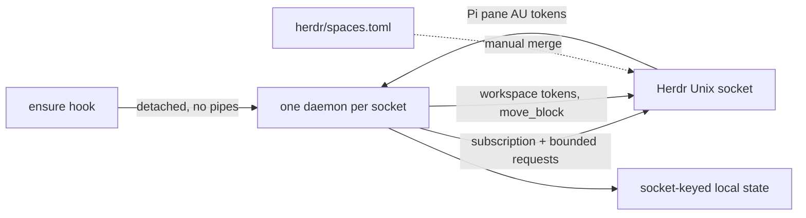

# Architecture

Evidence: Herdr 0.9.3 source at tag `v0.9.3`: `app/api/plugins/runtime.rs`,
`api/schema/events.rs`, `api/schema/workspaces.rs`, `api/schema/panes.rs`,
`app/api/workspaces.rs`, `app/api_helpers.rs`, `metadata_tokens.rs`,
`client/shell/sidebar.rs`, `ui/sidebar/tokens.rs`, `persist/snapshot.rs`,
`persist/restore.rs`; its plugin/socket/configuration docs. Tests use a local
fake server derived from these shapes, not a live Herdr session.

## Modules and dependencies

| Module | Owns |
| --- | --- |
| `bin/spaces.mjs` | `ensure`, `run`, `status`; detached spawn with ignored stdio and minimal env |
| `src/model.mjs` | Pure input validation, tokens, cell widths, activity history and sort plan |
| `src/transport.mjs` | Newline JSON request sockets, subscription, bounds, handshake and reconnect |
| `src/reporter.mjs` | Stable source, sequence, accepted diff/full/clear, TTL and retry deadlines |
| `src/state.mjs` | Socket identity, private storage, atomic writes, instance lock, config and bounded logs |
| `src/daemon.mjs` | Serialized reconciliation, event fencing, timers, persistence, ordering, health and shutdown |
| `herdr-plugin.toml` | Herdr startup/event hooks and optional status action |

Imports are Node standard library and sibling modules only. No package.json,
lockfile, build, renderer or dependency installation is needed.

## Reconciliation and failure boundaries

Subscribe first to the event list in `transport.mjs` (never metadata_updated).
After `subscription_started`, and after a bounded 500 ms event coalescing window,
read `workspace.list` and `pane.list` concurrently. One reconciliation at a time;
each request opens its own socket and waits at most one second. Events are
invalidation, not an unconditional snapshot patch: an epoch fences reads from
before an event/disconnection. Validate lists and matching pane counts, then
advance/persist history, report, and consider ordering. Pane metadata from any
reporter can arrive through `pane.updated` but never counts as activity.

A 30-second periodic tick refreshes ages and full TTL reports. A failed read
publishes nothing; retry reads from 250 ms up to 30 seconds. Report failures
have their separate 5–60 second deadlines. New events/ticks cannot bypass report
backoff. Reads are never attempted on a disconnected subscription. Reconnect
from 250 ms to 30 seconds, with a one-second handshake timeout; exit after two
minutes without a successful subscription. A responsive subscription with
failed reads remains running and records read failures; TTL expiry is truthful.

One subscription plus two read sockets are live on the normal read path;
reports and moves are sequential. Read replies are bounded to 1 MiB per line,
4096 workspaces and 16384 panes; history to 16384 entries and 1 MiB of entries.
Resource-ceiling/IO failures stop that reconciliation and retry, not partial
new display data. Renewal targets 30 seconds with responsive Herdr; a very
large or slow session can miss it, and TTL expiry is preferable to a false
reading. No latency/load benchmark is claimed.

## Lock and persistence

State is partitioned by the first 32 hex characters of SHA-256(socket path).
Single instance uses atomic rename of a populated, unique staging directory
into the socket lock directory. Contenders cannot observe a half-written empty
new lock. A dead owner is recovered by unlinking only its unique PID marker
then nonrecursive rmdir: a competing reaper cannot remove a new populated
owner directory. Live/EPERM PIDs and malformed lock contents fail closed.
PID reuse is conservative; no other process is killed automatically.

Atomic files use unique temporary files then rename; mode 0600. This prevents
partial JSON on ordinary interruption but is not fsync/power-loss durability.
History version 1 holds timestamps and persisted sorting signature/last move;
malformed history resets to first-seen now and logs a code. Config is read once
per run; invalid/missing config defaults and logs a code. Storage paths are
operator-owned; leaf symlinks for readable state/config/locks/logs are rejected.
Parents are assumed trusted. No shared store or cross-project code import.
Privacy and deletion are in the [README](../README.md#operations-and-privacy).

## Ordering

Worktree units match Herdr's `workspace_entries`: same `worktree.repo_key`,
at least two members and at least one non-linked member; the first non-linked
parent draws first, children follow user order. A group is quiet only if all
members are quiet. Group age is its most recent member activity. Non-quiet
units retain user order, quiet units sort least quiet first, quietest last;
equal ages break ties by canonical member IDs. All quiet IDs are moved in one
`workspace.move_block` request, omitting the anchor for end insertion. This
operation is atomic in Herdr; the unit focused in the validated snapshot never appears in the block.

Signature tracks quiet-unit membership and quiet order, not non-quiet order
or age text. Store it across daemon restarts. Unchanged signatures do nothing,
even after a manual drag. Changed signatures are held until the minute rate
limit permits a move. Failed moves do not accept the new signature; retry is
rate-limited and reads current state again. A dropped reply can have applied
on the server, but the next read avoids a duplicate move if already ordered.
An immediate pre-dispatch epoch check aborts plans invalidated by events while
diagnostics/persistence yielded. There is no server-side expected-focus/version
precondition: if the user focuses a quiet space between that check and Herdr
applying the move, it can still move to the bottom. Herdr preserves the active
workspace by ID (`app/actions.rs` move_workspace_block), so focus stays on it;
the next recompute marks it active. No undo or race-specific retry is added.
Number shortcuts follow Herdr position.

## Shutdown and observability

SIGTERM/SIGINT, connection exhaustion or startup failure cancel every timer,
close the subscription and fence work. Await the current bounded request path,
write final health/log codes, release only our lock marker. No token clears:
TTL keys expire, names freeze. Local health has aggregate reads, failures,
moves, reconnects, accepted report counts and timestamp. No resource names,
workspace IDs or payloads enter diagnostics. No external metrics server.
