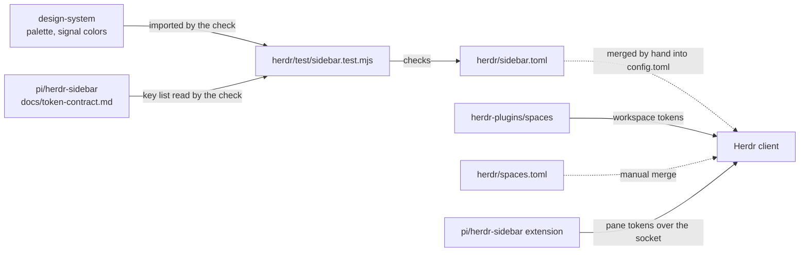

# Architecture

Status: current at the revision that added the project.
Evidence: `sidebar.toml`, `test/sidebar.test.mjs`, Herdr 0.9.3's configuration reference and its config loader and sidebar schema (`src/config/io.rs`, `src/config/sidebar.rs`, `src/cli.rs` `config check`).

## Files and dependencies

| File | Owns | Depends on |
| --- | --- | --- |
| `sidebar.toml` | The Pi agents-sidebar row override, their colors and rules, the theme colors the layout needs, and the 36-column width lock | Herdr's config schema; the token names in [the token contract](../../pi/herdr-sidebar/docs/token-contract.md); design-system colors, restated as values because TOML cannot import |
| `spaces.toml` | Spaces rows and global state-icon theme keys | Herdr schema; [Spaces contract](../../herdr-plugins/spaces/docs/token-contract.md); design-system colors |
| `check-config.mjs` | Isolated native parser checks for each fragment, merge and expected invalid rejection | Node stdlib; installed Herdr, only config check |
| `test/spaces.test.mjs` | Spaces color/key/role checks | Design-system exported palette; reads Spaces contract |
| `test/sidebar.test.mjs` | The checks that keep the fragment true to its two sources | `@industrial-os/design-system/foundation/palette` and `/signal-colors` by package name; reads the token contract document |

No code is shared. The check imports the design system only by package name, as every project may, and reads the token contract as a document: the contract is canonical in pi/herdr-sidebar, and the check fails if the fragment and the contract disagree rather than keeping a copy of the key list.

## Flow

A person merges the fragment into Herdr's `config.toml` and reloads. Herdr's client selects the `rows_by_agent.pi` override for canonical agent ID `pi` (replacing, not extending, its base rows), leaving other agents on their configured/default rows; the herdr-sidebar extension in each Pi pane reports token values; Herdr draws each row from the values present, dropping missing tokens and their separators and any row left empty. Styling lives only here; values live only in the extension. ACT has two mutually exclusive configured rows (d0+d1 and d2+d3), each 12 entries, because Herdr 0.9.3 caps a row at 16 entries. The Pi layout is eight of the maximum 16 configured rows. Empty row filtering (`src/ui/sidebar/tokens.rs`) precedes pane-block rendering; `row_gap` in `src/client/shell/agent_sidebar.rs` separates pane blocks only, so the inactive ACT row adds no gap. MDL fits eight variants in one row. The reporter selects stage variants, keeping the visible logical layout unchanged.

## Critical invariants

| Must remain true | Check |
| --- | --- |
| Every color is an exported design-system color | `test/sidebar.test.mjs` |
| Every token is in the contract key list, and every key has one row entry | `test/sidebar.test.mjs` |
| The configured rows fit Herdr's 16-row/16-entry limits; exactly one ACT alternative resolves per stage | `test/sidebar.test.mjs`; native parser |
| Only `rows_by_agent.pi` is set; global `rows` is absent | `test/sidebar.test.mjs` |
| The width is locked at 36 columns with `row_gap = 1` | `test/sidebar.test.mjs` |
| The fragment is a valid Herdr config by itself | `herdr config check` in [contributing](../CONTRIBUTING.md#validation-sequence) |

## Where the next change belongs

Another piece of maintained Herdr configuration, such as Space rows or keybindings, is its own TOML file here with a check beside it and an install section in the README. A Herdr plugin with code would be a separate project with its own language and toolchain.

## Limits and evolution

- Herdr has no config includes, so the fragment is merged by hand and drifts from the user's copy until merged again.
- Pi panes without the extension show no Industrial OS rows. Other agents retain their configured/default layouts.
- `row_gap = 1` is a panel-wide setting: all agents receive that spacing, not only Pi.

Spaces values and sorting belong to the separate plugin, not this config project.
Its `sp_`-prefixed contract key list is consumed by `test/spaces.test.mjs`;
Herdr workspace keys share a namespace across sources. Space names require
that plugin: no built-in workspace fallback is configured. Theme keys are global;
see [the wider color effects](design.md#spaces-theme-scope).
