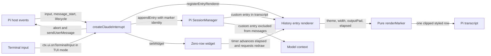
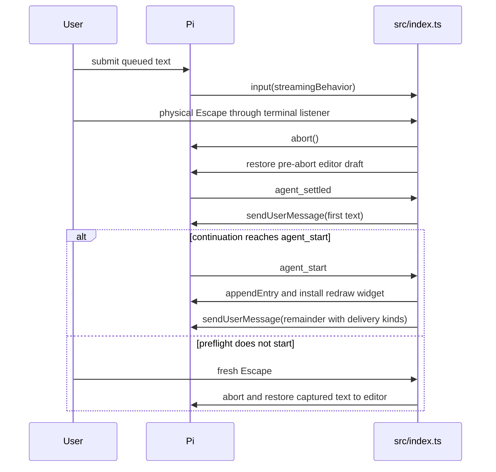

# Architecture

Status: current system; one source module, no proposed runtime modules.
Evidence: surveyed on 2026-10-07 at base revision `bb1ba4a`, reading all of `src/index.ts`, both `test/*.test.ts` files, `package.json`, `tsconfig.json` and the existing README. This describes this package, not a review of other extensions or a provider-backed end-to-end run.

## System and module map

The diagram's internal nodes are functions and registered components within the same source module, not separate files.

| Module/path | Purpose | Public entry point | Dependencies |
| --- | --- | --- | --- |
| `src/index.ts` | The only source module: queue observer, Escape/replay lifecycle and marker | Default `createClaudeInterrupt`; named `createClaudeInterrupt` and `renderMarker` for tests | Node `randomUUID`, Pi extension types, Pi TUI key/color/width helpers |
| `package.json` | Standalone package discovery and checks | `pi.extensions` points to `./src/index.ts` | Host peer packages; pinned development packages |
| `test/extension.test.ts` | Queue harness, renderer and timer contracts | Node test runner | Named source exports, real Pi Theme and TUI helpers |
| `test/extension-runner.test.ts` | Loader, asynchronous events, terminal routing and session persistence | Node test runner | Real Pi loader, ExtensionRunner, TuiMainScreen and in-memory SessionManager |

There are no design-system imports, runtime dependencies, database or custom storage layer. The runtime entry receives Pi's API; `renderMarker` receives explicit display inputs and does no I/O or clock reads.

## Representative flows

### Interrupt and continue

1. `input` observes entries with `streamingBehavior`, retaining text, delivery kind and an image-presence flag. Matching extension-origin replay inputs are consumed from `expectedReplay` so they are not captured twice. `message_start` removes delivered user messages, steering first, except the already-accounted-for continuation head.
2. `session_start` resets state and installs `ctx.ui.onTerminalInput` only in TUI mode. Escape release resets ownership without acting; repeats are consumed only for an extension-owned press. A genuine press first finalizes any animation.
3. With no pending core messages, no observed text, or an observed image, the press falls through to native handling. Otherwise it captures the queues, enters `aborting`, saves the draft, calls `ctx.abort()` and restores the exact draft immediately. Pi's TUI abort otherwise prepends cleared queue text to that editor.
4. A second press during `aborting` is idempotent. Text arriving during this window joins the captured batch. A late image is explicitly handled and rejected with a warning; its text is prepended to the editor and the earlier batch remains intact.
5. At `agent_settled`, any raced core queue is cleared by another abort while preserving the editor. The extension enters `starting`, records expected replay input, and sends the first ordered text with prompt-template expansion. It does not send the head before settlement.
6. At `agent_start`, the extension appends its marker in TUI mode, tracks the undelivered remainder as ordinary pending queues, and sends that remainder with original delivery kinds and prompt-template expansion. It clears interrupt state and skips the head's next user start. A new Escape can interrupt that remainder again.
7. If preflight never reaches `agent_start`, there is no marker. A fresh Escape clears restart tracking, requests abort, and prepends every captured text to the editor. That recovery does not guarantee cancellation of delayed preflight work.

### Marker animation lifecycle

`agent_start` creates a unique live identity, start time and elapsed frame state. `appendEntry("claude-interrupt-steering", { id })` creates the history record; only the matching live identity animates. A zero-row widget supplies a TUI redraw handle and disposal callback, never a second visible marker.

One timeout advances elapsed time by at least one frame or catches up to the elapsed wall-clock frame, whichever is later. It clamps to the animation window and schedules no more than 75 callbacks. Late wake-ups skip missed frames, and a backward clock jump cannot keep scheduling indefinitely. The exact visual timeline is in [design](design.md#directive-updated-marker).

Completion, a fresh Escape, widget disposal, session reset, shutdown, reload or switch finalize the entry and cancel the timer. `disposeAnimation` clears live state before requesting the final redraw; `clearAnimation` also removes the widget. The widget's own disposal does not recursively call `setWidget`. Ordinary messages and tool actions do not remove the history row. Saved entries render settled without restarting animation.

Shutdown freezes the last `outputPad` as plain data before reset. Retained entry components can still render while Pi replaces the transcript, without calling an invalidated runtime. A new runtime renders saved entries with its own settings.

## Data and contracts

- Pi owns the real queue. `PendingQueues` is only an observer: separate steering/follow-up arrays of `{ text, deliverAs, hasImages }`. `InterruptState` is either `aborting` or `starting`; no interrupt is `undefined`. `expectedReplay`, `skipNextUserStart` and Escape ownership prevent duplicate observation and accidental native aborts of a restarted run.
- Public APIs relied on: `pi.on` for input/message/session/agent events; `ctx.mode`, `ctx.hasPendingMessages`, `ctx.abort`; UI terminal subscription, editor get/set and warning notification; `pi.sendUserMessage`; entry renderer registration, `appendEntry`, `setWidget`, and `pi.getSettings().outputPad`. TUI key helpers distinguish press/repeat/release; `theme.style` and `truncateToWidth` own styling and clipping.
- Pi's queue and abort APIs do not expose an atomic "abort but retain this structured queue" operation. Observation followed by replay after `agent_settled` is not an atomic transaction or an exactly-once guarantee for arbitrary external queues.
- Durable data is only the custom marker entry with its UUID. Pi's session manager persists it as history, not as a model message. Queues, timers and animation state are transient; they are not serialized. Do not replace `appendEntry` with a context-bearing message API.
- Verify these assumptions against the documentation and public types of the Pi version being changed, not merely the wildcard peer range. [Compatibility](../README.md#compatibility) and [verification records](../CONTRIBUTING.md#verification-records) bound current evidence.

## Critical invariants

All code pointers below are within `src/index.ts`. Test titles identify existing checks, not proposed coverage.

| Must remain true | Relevant code | Test/check |
| --- | --- | --- |
| Replay waits for settlement and preserves the draft | Terminal listener and `agent_settled` | `extension.test.ts`: "Escape interrupts one queued text and continues only after settlement" |
| Steering precedes follow-ups and delivered text is not replayed | `ordered`, `message_start`, `agent_start` | `extension.test.ts`: "several messages retain Pi's steering-before-follow-up order without duplication"; `extension-runner.test.ts`: "real ExtensionRunner asynchronously re-interrupts a replayed queue without delivered duplicates" |
| Native no-queue behavior and abort idempotence remain available | Terminal listener | `extension.test.ts`: "Escape without a core queue remains native and an unsent draft is not a queue" and "repeated Escape while abort is settling is consumed without aborting twice" |
| Unsupported images are never silently replayed as text | `input` and image guard | `extension.test.ts`: "queued image attachments fall back to Pi's native Escape" and "a late image is rejected without discarding the captured text batch" |
| Abort-window text is replayed once | `input`, `agent_settled` | `extension.test.ts`: "text submitted during abort settlement is cleared once and replayed once" |
| Failed preflight leaves recovery Escape usable | `starting` branch | `extension-runner.test.ts`: "real ExtensionRunner leaves Escape available after asynchronous start failure" |
| Marker confirms continuation only and never enters model context | `agent_start`, `appendEntry` | `extension.test.ts`: "marker waits for confirmed continuation and stays out of ordinary, native and non-TUI paths"; `extension-runner.test.ts`: "real ExtensionRunner persists exactly one non-context marker at start and reloads it completed" |
| Renderer is deterministic, clipped and aligned | `renderMarker` | `extension.test.ts`: "marker rows fit every width from 0 to 160 in every frame, pad and color mode, clipping instead of reflowing" and "marker label starts on the same column as Pi's native abort notice for outputPad 0/1" |
| Timers are bounded and disposed on every animation exit | `schedule`, `advance`, `clearAnimation`, `reset` | `extension.test.ts`: "late timer wake-ups catch up and wall-clock jumps cannot extend the bounded animation" and "Escape, widget disposal and session cleanup finalize history and cancel every timer" |
| Owned repeats do not reach native abort; release never acts | Terminal listener | `extension-runner.test.ts`: "real TUI keeps owned repeats out of native focus across failed preflight and live continuation" and "real TUI routes Kitty release before focus without ending continuation feedback" |
| Retired components do not call an invalidated runtime | `currentOutputPad`, shutdown | `extension-runner.test.ts`: "real ExtensionRunner keeps retained marker components renderable after session replacement" |

Tests are in [test/extension.test.ts](../test/extension.test.ts) and [test/extension-runner.test.ts](../test/extension-runner.test.ts). Their isolated session bridge is not provider end-to-end verification.

## Where the next change belongs

An Escape race fix belongs in the existing input/settlement state machine, with a harness regression and a real-runner ordering check. Keep the renderer unchanged. A marker appearance change belongs in `renderMarker` and its constants, with cell/frame tests and design updates; it must not change queue semantics. A lifecycle change belongs in `createClaudeInterrupt`, preserving entry identity and disposal and adding real-loader coverage where the host boundary changes.

Keep one source module while these behaviors remain cohesive. Extract a module only for a real independently changing responsibility, not a hypothetical shared UI package. Any marker data change must keep existing saved entries renderable in a settled state and test reload/session replacement; no schema migration exists today.

## Evolution and known limits

- **Structured content:** queued images/attachments are unsupported. An observed image triggers native Escape rather than lossy replay; an image submitted after interruption begins is rejected with a warning and its text restored. Exact structured semantics require a public atomic queue snapshot plus abort/requeue API, or a native interrupt-and-continue operation.
- **Input-transforming extensions:** unsupported in combination. Replay passes through Pi's input pipeline again, so another extension can transform text twice or handle it differently. The replay observer is not a composition protocol.
- **Compaction-time queue:** unsupported because Pi keeps it inside the interactive UI and does not expose it to extensions.
- **Slow restart preflight:** Escape restores captured text, but Pi cannot guarantee cancellation of work that has not reached `agent_start`. A delayed preflight may still start; the user must check the transcript before resubmitting restored text.
- **Unobserved queue:** when Pi reports pending messages but this observer has no queued text at all, Escape falls through. Pi exposes only a boolean, so mixed observed/unobserved entries cannot be detected reliably.
- **Terminal behavior and motion:** physical-key ownership, legacy-repeat ambiguity and the absence of reduced-motion controls are specified in [design](design.md#accessibility-and-platform-behavior). Remapping native interrupt does not change this extension's input seam.
- **Evidence:** no interactive Pi/Herdr verification for the move, and no measured production performance baseline. Measure a suspected redraw or large-queue problem before adding a cache, scheduler layer or service. Revisit observer design only when a concrete host contract or requirement changes.

## Technical decisions

None recorded. No decision directory is needed for this documentation conversion.
