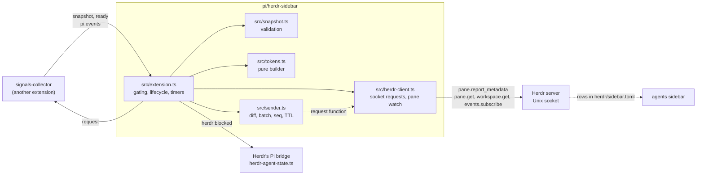

# Architecture

Status: current at the revision that added the extension.
Evidence: the full source and tests of this extension; Pi 1.0.4's extension types, event bus and loader as installed; Herdr 0.9.3's source at tag `v0.9.3` (`src/metadata_tokens.rs`, `src/app/api/panes.rs`, `src/terminal/metadata.rs`, `src/api/subscriptions.rs`, `src/api/schema/events.rs`, `src/api/schema/workspaces.rs`, `src/app/api/workspaces.rs`; for seen, `src/app/actions.rs`, `src/app/api.rs`, `src/app/api_helpers.rs`, `src/app/creation.rs`, `src/workspace.rs`, `src/server/headless.rs`) and its socket API documentation. The merged collector/sidebar packages are now exercised through Pi's real loader in both orders with offline inputs; the collector's side remains snapshot contract v1.

## System and module map

| Module | Owns | Depends on |
| --- | --- | --- |
| `src/extension.ts` | The default export Pi loads: the TUI-and-Herdr gate, one runtime per session, event-bus subscriptions, the `herdr:blocked` balance, the subagents-finished flag, the re-render timer, disposal | The other four modules; Pi's extension types |
| `src/snapshot.ts` | The v1 channel names and `readSnapshot`, which validates a payload and keeps only what the sidebar shows | Nothing |
| `src/tokens.ts` | `buildTokens` and `nextTokenChange`, the [token contract](token-contract.md) as code, and `nextSubagentsFinishedAt`, the flag's pure transition | Node `path`; Pi TUI's `visibleWidth` |
| `src/sender.ts` | Report composition: diff against accepted state, batches, the stable source, `seq`, TTL renewal, retry, the shutdown clear | A request function; the key list |
| `src/herdr-client.ts` | Herdr's newline-delimited JSON protocol: one bounded request per connection, and the pane-status/workspace-label/visibility subscription with reconnect | Node `net` |

Pi supplies `@earendil-works/pi-coding-agent` and `@earendil-works/pi-tui` as peers. Nothing imports another project's code; the collector's types are restated in `src/snapshot.ts` as the subset consumed.

## Inputs

**The snapshot.** The signals-collector publishes on Pi's in-process event bus: `signals-collector:v1:snapshot` after every change, `signals-collector:v1:ready` after session start and tree navigation, and it answers `signals-collector:v1:request` synchronously by calling `reply`. Pi's bus dispatches synchronously, so a reply that has not arrived when `emit` returns means no collector. On start the extension requests a snapshot; on every matching `ready` it requests again, so either load order works and a reloaded collector, whose sequence restarts, is picked up. Pushes are accepted only in increasing `seq`; a reply is the collector's current snapshot and replaces whatever was held. `readSnapshot` drops payloads whose `version` is not 1 or whose `sessionId` is not this session's, cuts free text to 200 code units, and turns every malformed field into unknown.

**Herdr's pane state.** `watchPaneState` subscribes to `pane.agent_status_changed` for this pane plus `workspace.renamed`, `workspace.updated`, `pane.moved`, `workspace.focused`, `tab.focused` and `pane.focused` (`events.subscribe` request types). Herdr 0.9.3's `EventEnvelope.event` serializes lifecycle kinds as snake_case: `workspace_renamed`, `workspace_updated`, `pane_moved`, `workspace_focused`, `tab_focused` and `pane_focused`. The special `SubscriptionEventKind` `pane.agent_status_changed` stays dotted. The client's one transport-boundary map normalizes those known wire names to the dotted request names before dispatch; unknown kinds are ignored. These lifecycle events trigger reads immediately rather than waiting for the periodic refresh. After Herdr acknowledges with `subscription_started`, it reads `pane.get` for the status, `workspace_id` and `tab_id`, then `workspace.get` for `result.workspace.label` (the SPACE title) and the pane's visibility (`focused` and `active_tab_id`; see [below](#seen-and-the-subagents-finished-flag)). Focus events only invalidate: each one re-reads both rather than trusting its payload. Workspace events re-resolve the label; unrelated workspaces are ignored. Herdr 0.9.3 recomputes an automatic label (a workspace without a custom name) from the workspace's Git state without any workspace event (the Git refresh in `src/app/actions.rs`; events come only from renames and API updates in `src/app/api/workspaces.rs` and `src/app/api/worktrees.rs`), so the sender's 20-second TTL renewal also calls the watch's `refresh`, which re-reads both on the live subscription and reports only a change: such a label can lag by up to one renewal cycle. A pane move has `previous_pane_id` and `pane.pane_id`; cross-workspace moves change the canonical pane ID, so the watch re-subscribes and subsequent reports/clears target the new ID. A move that keeps the ID, within the workspace, keeps the subscription and only re-reads, so the status never flashes unknown. Missing/malformed labels fall back to the Active folder basename. An event that arrives while the read is in flight is newer, so the read's answer is discarded and repeated. A failed or timed-out `pane.get` or `workspace.get` reports nothing new and is retried on the same subscription with exponential backoff from 250 ms to 30 s, reset by a complete read, so a transient timeout does not wait for the next event. On a fresh connection the state is already unknown; on a live subscription the status events keep the status current, so a slow periodic refresh never blanks row 1. A failed `workspace.get` keeps the label of the same workspace, and keeps visibility only when no focus event or same-ID move has arrived since the last complete read; after a focus change, or for a different workspace, they stay unknown. A dropped connection, an `events_lost` error or a rejected subscription makes the status unknown and schedules a reconnect with exponential backoff from 250 ms to 30 s; every new subscription re-resolves status, canonical pane ID and workspace label. Reads from dropped/replaced connections cannot publish.

## Flows

**Start.** On `session_start` the previous runtime, if any, is disposed. The extension then checks the gate: Pi's `ctx.mode` is `tui`, `HERDR_ENV` is `1`, `HERDR_PANE_ID` is set and `HERDR_SOCKET_PATH` is absolute. Subagent children run in print, JSON or RPC mode with the parent's environment, so the mode check is what keeps them silent. Outside the gate nothing is subscribed, connected or emitted. Inside it, the runtime subscribes to the snapshot and ready channels, starts the status watch, requests a snapshot, and reports the state row with unknowns if no snapshot came back.

**Render.** Any new snapshot, status, SPACE label or visibility first advances the subagents-finished flag, then calls `buildTokens` with `Date.now()` and the home directory, hands the map to the sender, and asks `nextTokenChange` when a displayed duration (goal time, phase age or finished age) next changes its text. One unref'd timeout re-renders then, never sooner than a second after the last render.

**`herdr:blocked`.** When a valid snapshot's `question` turns non-null the extension emits `{ active: true }` once; when it turns null, `{ active: false }` once. Disposal emits the final `false` if a question was still pending, so shutdown, reload and session replacement leave the count balanced. Herdr's Pi bridge (`~/.pi/agent/extensions/herdr-agent-state.ts`, installed by Herdr) counts these to report the blocked state. This replaces rpiv ask-user-question's emission for the same wait.

**Shutdown.** `session_shutdown` disposes the runtime: the re-render timer is cleared, the bus subscriptions and status watch are closed, a pending question is balanced, and the sender composes and sends the clear of every key. Pi awaits this for at most 1.5 seconds.

## Seen and the subagents-finished flag

Herdr's agent status follows only Pi's root agent, through Herdr's own Pi bridge (`herdr-agent-state.ts`, which this project does not change). Herdr 0.9.3 reports `done` as idle and not seen (`pane_agent_status` in `src/app/api_helpers.rs`), and it sets a pane unseen only on the root agent's working-to-idle transition. While Pi's root is idle and its subagents run, Herdr reports idle, and their later finish never becomes `done`. The sidebar therefore shows `SUB` while `snapshot.units` ≥ 1 and the root is not working, and keeps its own flag for the finish, as the [token contract](token-contract.md#row-1) defines. The flag lives in the runtime in `src/extension.ts`; its transition is the pure `nextSubagentsFinishedAt` in `src/tokens.ts`. It changes nothing in Herdr: no state report, no notification, no attention order.

**Herdr's seen rule, as read in 0.9.3.** At a completion transition `apply_pane_state_change` (`src/app/actions.rs`) sets the pane's `seen` to `active_tab_suppresses_notifications`: the pane is in the active tab of the active workspace (`pane_is_in_active_tab`) and the foreground client's terminal window is not known to be unfocused (`outer_terminal_focus != Some(false)`). Any non-idle state sets `seen`. Later it becomes seen when its tab is switched to (`Workspace::switch_tab` in `src/workspace.rs`, also through `switch_workspace` and `switch_workspace_tab`), and when `mark_active_tab_seen` runs for `pane.focus`, `agent.focus` or the foreground client regaining terminal focus (`src/server/headless.rs`).

**The approximation.** The public API exposes the active workspace (`WorkspaceInfo.focused`, which is `state.active == Some(index)` in `src/app/creation.rs`), its `active_tab_id`, and each pane's `tab_id`. The sidebar treats the pane as seen exactly when its tab is the focused workspace's active tab. Herdr emits `workspace_focused`, `tab_focused` and `pane_focused` together whenever the focused pane changes (`emit_focus_api_events` in `src/app/api.rs`), so the watch re-resolves visibility then, and after every reconnect. Being visible clears the flag, which mirrors Herdr marking the active tab seen on every switch to it. A drop to zero units while visible sets no flag, matching Herdr's completion in the active tab.

**Unknown visibility counts as not seen.** When `pane.get` or `workspace.get` fails, or the subscription is down, visibility is unknown. A finish then sets the flag, as Herdr's `pane_is_in_active_tab` is false without an active workspace: a completion is shown rather than hidden. Unknown never clears the flag; only a resolved visible pane, the root working or units rising does. The flag survives a reconnect, and the reconnect's read clears it if the pane became visible meanwhile.

**Limits.**

- Terminal-window focus is not public. Herdr leaves a completion in the active tab unseen while the foreground client's window is unfocused; the sidebar treats that pane as seen and shows `IDL`.
- With several clients attached, Herdr's active workspace and tab follow the client that navigated last (`set_default_shell_target_from_client` in `src/server/headless/client_views.rs`). The sidebar follows the same server state, so a pane visible only to another client's view counts as unseen once that client is no longer the last to navigate.
- Connected focus changes trigger reads from their snake_case lifecycle events. A focus change made while the subscription is down, including after `events_lost`, is picked up by the reconnect's read; until then visibility is unknown. Each 20-second renewal re-reads it as well; that interval is not the normal focus, rename or move update delay.
- The flag belongs to one runtime: a session replacement or reload starts without it, and Herdr's own `done` is unaffected.

## Reporting to Herdr

`pane.report_metadata` patches the pane's token map: a string sets a key, `null` clears it, omitted keys stay. The sender keeps the map Herdr last accepted. A report sends only the keys whose value differs; when that state is unknown (the first report, after any failure, and at each TTL renewal) it sends every key in the list, set or cleared, so no stale key lingers. Clears go first so a pane near Herdr's 32-key limit does not reject the sets, and requests carry at most 16 keys. One flush runs at a time; updates meanwhile replace the desired map and are sent after it.

**One stable source, clock-based sequence.** Every report uses the source `industrial-os:herdr-sidebar` and a `seq` of `max(Date.now() × 1000, previous + 1)`, allocated when the report is composed. A runtime-unique source was rejected after reading Herdr 0.9.3:

- Tokens are one map per pane, not per source (`src/metadata_tokens.rs`, `MetadataTokens::patch`), so a late `null` from any source removes the key. A different source would not protect a new runtime's tokens from an old runtime's late clear.
- The only ordering guard is `seq`, compared per source (`src/terminal/metadata.rs`, `accept_metadata_report`).
- Each source that sends a sequenced token report takes one of 32 slots for the pane's lifetime, never released (`MAX_SEQUENCE_SOURCES` in `src/metadata_tokens.rs`; the `metadata_sequence_source_limit` error in `src/app/api/panes.rs`). A source per runtime would fail after 32 reloads in one pane.

With one source, the old runtime's shutdown clear is composed at shutdown, before the new runtime exists, so its `seq` is lower than anything the new runtime sends; if it arrives late, Herdr ignores it. The old runtime's timers are disposed first, so it composes nothing afterwards. The extension takes one sequence slot for the pane's whole life. Herdr answers an ignored stale report exactly as it answers an accepted one, so the sender cannot tell them apart; a backwards wall-clock step therefore makes Herdr silently ignore reports until the clock passes the last `seq`.

**TTL.** Every request carries `ttl_ms` of 60 seconds, which applies to the keys it sets. A successful full report every 20 seconds renews them; each renewal also calls the sender's `onRenew`, which re-reads the pane and workspace (see [inputs](#inputs)). Failure backoff can outlast the TTL, so persistent rejection may let rows expire rather than keep stale data. If Pi exits without its clear, for example after a crash, the tokens expire within a minute.

**Failures.** A request times out after one second. An error reply, a timeout or a connection failure marks the state unsynced with its cause and retries the full report with exponential backoff and jitter, starting at five seconds and capped at sixty seconds; a complete successful report resets the delay. Updates and TTL renewals cannot bypass backoff; Pi never sees the failure, and the state never records it as accepted.

## Critical invariants

| Must remain true | Where | Check |
| --- | --- | --- |
| Nothing reports outside TUI mode or outside Herdr | `herdrTarget` and `start` in `src/extension.ts` | `test/extension.test.ts`: print, JSON, RPC and four outside-Herdr environments make no connection |
| Unknown is never zero; no snapshot reports `g1`, SPACE when known and row 2's unknowns | `src/tokens.ts`, `src/snapshot.ts` | `test/tokens.test.ts` |
| Every report clears the keys that do not apply | `src/sender.ts` | `test/sender.test.ts`, `test/extension.test.ts` |
| One source for every runtime, and a replaced runtime's late clear is ignored | `src/sender.ts` | `test/sender.test.ts` reload-safety case |
| `herdr:blocked` is balanced on every path | `setQuestion` and `dispose` in `src/extension.ts` | `test/extension.test.ts` |
| State precedence is QNS, BLK, WRK, SUB, DNE, IDL/UNK; the subagents-finished flag is set only by a real drop to zero units while not working and not seen, and cleared by seen, work or units | `displayState` and `nextSubagentsFinishedAt` in `src/tokens.ts`, `updateFinished` in `src/extension.ts` | `test/tokens.test.ts`, `test/extension.test.ts`, `test/herdr-client.test.ts` |
| Nothing is sent after shutdown, and shutdown is bounded | `src/sender.ts`, `dispose` | `test/sender.test.ts`, `test/extension.test.ts` |
| A failed report is never success-shaped | `src/sender.ts` | `test/sender.test.ts` |

## Limits and evolution

- Pi panes without this extension show no Industrial OS rows; other agents retain their configured/default rows because the configuration overrides only `rows_by_agent.pi`.
- Full reports span multiple requests and can be half-applied for up to one retry interval; the next successful full report self-heals.
- The first line of bash commands and tool paths leave Pi for Herdr's in-memory pane tokens as `ev_act`, bounded and sanitized for display. This is display data egress, not command execution.
- The tests model Herdr with a fake server written from the 0.9.3 source; a later Herdr that changes token semantics, limits or event shapes needs that model and this guide updated.
- The pane watch keeps one connection open per Pi session; the sender opens one short connection per request.
- Windows named pipes are handled as Herdr's own bridge does but are untested.
