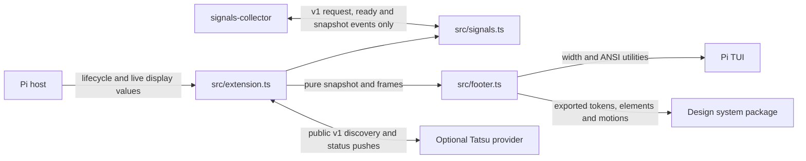

# Architecture

Status: current integrated system; no proposed runtime modules.
Evidence: current `src/` and `test/` files, `package.json`, installed Pi 1.0.2 and pi-subagents 0.76.0 public contracts inspected for the native v9 integration on 2026-10-05; pi-background-tasks 2.6.9 status output and Pi 1.0.4 status repaint inspected on 2026-10-07; CMP compaction collection verified against installed Pi 1.0.4 on 2026-10-06; USG built against recorded CodexBar 0.60.3 output and its [CLI documentation](https://github.com/steipete/CodexBar/blob/main/docs/cli.md) on 2026-10-07.

## System and module map

| Module/path | Purpose | Dependencies/check |
| --- | --- | --- |
| `package.json` | Explicit Pi entry `src/extension.ts` and test script | Host Pi/TUI peers; root-linked design system |
| `src/extension.ts` | Footer/motion command/lifecycle, Ponytail and Tatsu observation, live render-time host values and countdown repaint | Public Pi, footer and signals; `test/extension.test.ts` real-loader display-only integration |
| `src/signals.ts` | Local wire DTO types and subscribe/request/ready consumer; no producer imports or I/O | Public Pi events; `test/signals.test.ts` absent/stale/load-order/composition/byte checks |
| `src/footer.ts` | Unchanged pure, fixed-palette, width/terminal-safe rendering and decoration projection | Node path, Pi/TUI, signals types, design-system exported subpaths; existing footer/shard/color tests plus context parity vectors |

Workspace/usage collection modules and tests moved to [signals-collector](../../signals-collector/docs/architecture.md). This consumer owns only display state. Home, wall-clock USG `now` and monotonic motion time enter through the adapter; render never reads environment/clocks or performs I/O. Raw snapshots cross only the [v1 event contract](../../signals-collector/docs/contract.md).

## Design-system rendering seam

`src/footer.ts` imports only `@industrial-os/design-system/<group>/<name>` exported subpaths; it never imports another extension or `motions/frame`. The design system is pure, standard-library-only and I/O-free. The extension's manifest still declares only Pi peers; the repository root install supplies the linked package.

| Footer piece | Design-system public functions |
| --- | --- |
| Numbered/USG/ROOT plates | `labelPlate` slabs and custom USG style |
| CMP and AU | `countPlate` with `COUNT_PLATES`, after host count normalization |
| Lamp and unit marks | `lamp` field/solid poses; `unitMarks` with projected shuttle sides |
| Large numeral | `numeralGrid`, `numeralAt`, `numeralLines`; roles adapted to unchanged Hue memory |
| PNYTL | `pnytlPlateParts`, one paint call per mode letter |
| Tatsu/BG | `stateChipParts`, including generic BG count suffixes and explicit Tatsu `number-text` renderer compatibility; producer parser/hints stay host-owned |
| USG | `providerColumnParts`, `litSegments`, `staleAge`, internal countdown formatting; normalized host data/explicit age policy |
| CTX | `gaugeTrack`, `gaugeParts`, `gaugeScaleParts`, `gaugeTick`, `gaugeExtent`, `gaugeZone` |
| Frame | `frameGeometry`, `frameStubs`, `frameCenter` |
| Exact scoped decorations | `flash`, `blink`/`blinkOn`, `nudgeOffset`, `cycle`, `fade`, `latch`, `beacon`, `fillIn`, `edgePulse`, `burnOut` |

`COLORS` is the explicit semantic alias map from `ACID_BLACK`/`SIGNAL_COLORS`, and `C` converts those values to Pi RGB. The adapter maps DS role styles to Hue-valued owned cells or existing Pi paint calls. It never globally merges opaque Runs: paths, repository/PR/model text, producer hints and raw statuses keep Pi sanitization, Unicode/grapheme measurement, wrapping, clipping and exact SGR/reset boundaries. Host layout retains admission, wrapping/anchors, zone/ghost/frame metadata and header/side-panel placement. No clock or I/O moves into an element.

`stateChipParts` defaults to strict count validation. The footer opts into `countPolicy: "number-text"` to retain the renderer's typed-number contract for negative/fractional/NaN/Infinity/unsafe `commitsBehind` values. `src/extension.ts`'s `count` adapter admits only non-negative safe integers, so these are renderer-only edge cases, not producer admission. Complete DS `stateChip`/`stateChips` remain strict.

All motion state, RNG draw order, plans and scheduling remain in the extension. Seeded foundation math replaces the duplicated generator with the old `seed | 0` boundary. Boot plans, plate wipes, re-strikes, registration ghosts, fill glitches, PNYTL bursts and unit shuttle retain their existing host implementations. Tatsu warm-up and USG row boot specifically remain host compatibility effects because they can hide warning/critical content, contrary to DS's unchanged cue guard. State colors passed to DS motions remain roles, never literal-color bypasses. Manual negative pre-roll/invalid phase projections remain host compatibility handling; DS time stays non-negative.

## Representative flows

### Session start and snapshot discovery

Restore display state and install the TUI footer; subscribe to snapshot and ready before a synchronous request. Matching ready re-requests, so collector-first and consumer-first both work. Validate version/live session ID and reject older sequences. No callback before emit returns means absent; asynchronous callbacks are ignored. Missing collector renders Active `unknown`, Git pending, AU/CMP unknown and no optional USG row, while live CTX/MDL/thinking/ROOT/statuses remain available. Replacement re-handshakes and detaches old listeners; obsolete components/session IDs cannot update the display.

### Decorative motion

The installed TUI footer owns one `MotionState` and at most one unref'd decoration timeout. The adapter supplies monotonic `performance.now()` time and a fresh cryptographic 32-bit seed to `startMotion(snapshot, now, seed, boot)`. Each render builds a fresh snapshot, calls `advanceMotion`, then projects `motionFrame`. `nextMotionDelay` schedules the next decoration step, preserving an already-earlier wake. A wake advances state against the last rendered snapshot before repainting/rearming; the ensuing render observes current host values. The wake performs no telemetry collection. Plans are generated once per event, not per frame; late wakes do not run an unbounded catch-up loop.

`/footer-motion` sets a session-local flag that survives same-session tree restore and resets for a new session or extension reload. Off clears the decoration timeout and renders the settled frame; on restarts with a fresh seed and current snapshot without replaying boot or accumulated off-time changes. Collector Git/PR/activity updates continue independently. Replacement, tree restore and shutdown dispose owned work; stale components cannot stop replacements. Non-TUI modes install no footer or signals/PNYTL/Tatsu observers and do no collection.

### ROOT and optional fleet activity

`FooterSnapshot.activity` uses `{ working: !ctx.isIdle(), units: snapshot.units ?? null }`. ROOT stays live at every render, with lifecycle repaints; `agent_end` is not settlement. AU is the collector's validated native active-work total (queued/pending/workflow containers included), not an exact running-agent count. Missing/failing collection is Unknown, never zero. Protocol validation/timing/disposal belong to the [collector](../../signals-collector/docs/architecture.md).

### Ponytail status integration

The optional integration consumes the **existing** Ponytail 4.13.0 `setStatus("ponytail", text)` output through Pi's public footer status map. It neither imports Ponytail nor uses a mode RPC. Only recognized content of this exact key moves into the dedicated PNYTL plate; the host map is never changed. Every other key, and any unrecognized Ponytail warning/format, stays in EXT with existing sanitization/styling/wrapping.

The adapter checks at most 512 UTF-16 code units before stripping SGR. It accepts only the anchored producer format: `○` or `●`, ` 🐴 ponytail: `, then exactly `🌿 LITE`, `⚡ FULL`, `🔥 ULTRA` or ` REVIEW` (the latter includes the producer's extra space for its absent legacy icon). Other controls, extra text, icon/label mismatches and incompatible formats yield UNK while retaining raw text for safe display. Current mode is never inferred from defaults, prompts or session entries. The leading dot is Ponytail's own activity signal (`●` from its `agent_start` to `agent_end`): it is passed as `FooterSnapshot.ponytailActive` and drives only the plate's activity light, never a mode transition. A dot-only status change requests a repaint like a mode change.

OFF is special: Ponytail explicitly calls `setStatus("ponytail", undefined)`. Pi deletes the map key, making OFF indistinguishable from never emitted/hidden/reset **in the map alone**. The footer therefore narrowly observes that public method, forwarding the original receiver, arguments, return and errors first. It captures only key `ponytail`, with current session/component/UI ownership checks. There are no private runner imports or upstream status suppression. A one-shot unref'd next-turn initialization timer changes CHK to UNK when no evidence arrives; there is no polling or query timer. Render reads only in-memory host data.

**Compatibility boundary and activation:** enable Ponytail status emission and load pi-status-bar **before** Ponytail. Real Pi 1.0.4 tests prove its public event contexts share a UI object and that local package order determines these handlers' order. The observer attaches synchronously with the footer factory before subsequent Ponytail session handlers. Known startup text is recoverable in either order; an initial OFF clear that occurred before attachment is not, and stays UNK until a later explicit emission. New/resume/fork/tree reset OFF evidence. Same-session footer replacement retains observed OFF; changing the UI object invalidates it. Rebinding occurs on session restoration or next render after public UI replacement; a clear before rebinding is not recoverable. Normal host reload binds UI before session_start, so the activation order covers it. This is a tested shared-UI assumption, **not a documented status subscription guarantee**; revalidate when upgrading Pi/Ponytail.

Each UI object has one reusable narrow tap in a WeakMap, with one active observer callback. Disposal clears the initialization timer and callback, and restores the original method only if our wrapper is still the current method. A later foreign wrapper is never overwritten; when it delegates to our tap, reuse avoids stacking wrappers across replacements. A non-delegating replacement prevents clear observation; known map content still works, but no unseen clear can be inferred. Old UI callbacks cannot publish to the new UI. Non-TUI installs no observer. Fallback footers continue receiving original host status data.

`FooterSnapshot.ponytail` remains optional for renderer compatibility; native snapshots always supply it. Pure renderer/motion contracts are unchanged: two random subsets on a real known-mode change, immediate current text/ink, no ambient plate effects, no off-time replay. The existing decoration timer and retained flash budget remain independent of status observation. See [design](design.md#motion).

Sources inspected read-only: Pi 1.0.4 `dist/core/extensions/runner.js`, `dist/core/footer-data-provider.js`, `dist/core/agent-session.js`, `dist/modes/interactive/interactive-mode.js`, public extension types/docs; Ponytail 4.13.0 `pi-extension/index.js` and `hooks/ponytail-config.js`. The portable suite uses synthetic producer fixtures with the real Pi loader/runner. A separate explicit-prerequisite, no-install supplemental check exercised the actual installed Ponytail producer with isolated UI/sessions/config, including startup/load order, commands, legacy restore, hidden output, default versus current, and disposal. No live settings/install/reload occurred.

### Tatsu status integration

A footer-owned, TUI-only observer consumes pi-tatsu-status-bar's **public v1** `tatsu-status:request`, `tatsu-status:ready` and `tatsu-status:changed` events without importing that package or registering a formatter. It subscribes to changed and ready before requesting; discovery replies are synchronous cached reads, never checks. No reply before emit returns means absent. Each ready re-requests, including provider restart. Only synchronous replies from the current request can publish; old API objects are not retained.

The adapter validates version 1, phase inactive/checking/completed, exactly one each of tatsu-cli and agent-workspace, and known component states. It normalizes components to CLI then workspace and copies only `{ phase, components: [{ component, state, commitsBehind?, localChanges? }] }`. Invalid optional counts (not safe nonnegative integers) and flags (not booleans) are dropped. Provider text/detail/reason/SHAs and other fields never enter state. Invalid snapshots clear the structured value, never become current.

The observer holds the last completed snapshot: while a later snapshot is phase checking, `read()` returns that completed one instead, so periodic refreshes never blank a shown result. An inactive, invalid or absent snapshot clears the held result. Only a valid checking/completed snapshot removes raw key `tatsu-status` from the **presentation** status map. The renderer inserts the structured entry at that key's sorted EXT position, even with hidden provider text; the host map is untouched. Absent, incompatible, invalid or inactive data leave raw text visible with the existing sanitization, styling and wrapping, or no entry if the provider clears it. Other statuses and Ponytail handling are unchanged.

Every handler/read requires live session ID, observer/component identity and captured UI ownership. Disposal unsubscribes both listeners and clears the sample; old callbacks and delayed replies cannot publish. Non-TUI installs nothing. Changed and discovery request repaints without polling or a new timer. Pure motion memory observes appearances and previous completed results (checking retains the baseline; invalid/inactive resets it), projects draw-in/checking/latch/beacon frames, and wakes through the existing single decoration timeout. Shared USG `drawInText` draws current single-width characters behind a three-cell LOCKED front; wrapped content lines sweep from their first content cell together, excluding the EXT label. The appearance warm-up is a fixed 14 ticks, scheduled from the footer boot's EXT tick when Tatsu is present at (or appears during) the boot, otherwise immediately; frames before it starts render the entry in the field colour. Resume samples current values without replaying transients. The renderer builds one pre-styled text part per component (dim label, then the coloured state carrying every decoration) and lays them out itself, three field cells apart, breaking only between parts; a part wider than its line falls back to the shared status wrap. Checking shape and code fade share the motion epoch and 150 ms cadence; beacon uses the last 150 ms of each 4000 ms epoch period. The entry is a pre-styled run excluded from ghosts/re-strikes.

Contract sources inspected read-only: provider README **Extension integration (v1)**, `src/lifecycle.js`, `src/checks.js`, `src/extension.ts`; installed Pi public event-bus implementation/types and existing loader/runner integration boundary. Deterministic tests use a tiny event provider factory with the real installed loader/bus and no Tatsu subprocesses or live configuration.

### Background-tasks status integration

pi-background-tasks 2.6.9 calls `ctx.ui.setStatus("background-tasks", text)` with its label wrapped in a light-blue SGR chip, or clears the key. That text already reaches the footer through Pi's public status map, so the integration is renderer-only: no observer, adapter state, import, event or polling. `backgroundTasks(raw)` in `src/footer.ts` is a pure parser of the producer's exact label grammar (canonical in [design](design.md#background-tasks)); it returns counts, hint, `/bg-clear` and update version, or undefined. The renderer calls it for key `background-tasks` only: a recognized value becomes pre-styled parts at that key's sorted EXT position, laid out by the same part-breaking helper as Tatsu; undefined keeps the raw status path byte for byte. The host map is never changed, and no state is inferred from absence.

Motion memory records only whether a recognized RUN count is present (`MotionState.backgroundRunning`, observed by `startMotion`/`advanceMotion` from the snapshot's status map). While it is, `nextMotionDelay` wakes at every ROOT lamp edge, Working or Idle, and the renderer chooses the `◆` ink from `frame.pulse`, the same epoch tick that drives ROOT's lamp. Pi 1.0.4's interactive `setExtensionStatus` requests a render after updating the map; that render's `advanceMotion` observes the change and the following `schedule` arms the next wake through the existing single decoration timeout. The entry is pre-styled text, so the footer boot, ghosts and re-strikes never reach it.

Contract sources inspected read-only: pi-background-tasks 2.6.9 `src/extension.ts` (`updateUi`, `lightBlue`), `src/core/config.ts` (`dockShortcutFooterHint`) and `src/core/common.ts` (`parseSemver`, `isNewerVersion`, `formatUpdateSegment`); Pi 1.0.4 `dist/modes/interactive/interactive-mode.js` (`setExtensionStatus`) and `dist/core/footer-data-provider.js`. Tests use synthetic producer strings through the real loader's UI context, not the producer package.

### USG shared usage display

The [collector contract](../../signals-collector/docs/contract.md) owns provider parsing, machine-wide cache/watch/locking, round freshness and failures. Status-bar consumes installed/provider samples only; no CodexBar fetch/timer/cache remains here. It supplies its wall-clock `now` for countdowns/staleness. Absent/unknown/false installed hides the optional row; failure retains the collector's last good per-provider sample, never raw output.

`usageRepaintDelay` selects the next countdown-minute/stale-age/15-minute boundary. One unref'd **repaint-only** timeout is independent of motion, and clears on disposal. The renderer derives squares/layout from the supplied windows; its `USAGE` declared window shapes are presentation, not duplicate parsing rules.

USG decoration memory in `MotionState` is pure and driven by the snapshots `advanceMotion` observes at the supplied monotonic `now`: each window's sample stamp, lit count and edge period; burn-outs (a newer stamp with fewer lit squares); `usageShown`, whether the row was present; `usageBoot`, when the row appeared (absent to present, including after it was hidden, or present at a booting `startMotion`); and `usageFill`, each provider's fill-in start. The row boot is the draw-in alone and schedules no fill-ins. Once it has ended, a provider that gains data (from none) fills in from `now`; data that arrives during a row boot gets no fill-in, then or later. A newer sample never restarts a fill-in, and a running row boot or fill-in starts no burn-out. `motionFrame` projects these as `usageBoot` (ticks since the row booted, for `USAGE_BOOT_TICKS`), `usageFill` and per-window `usage` effects (edge pulse step or burn), suppressing every USG effect during the row boot and a window's pulse during its fill-in or burn-out. The renderer turns `usageBoot` into the draw-in front: `(k + 1)·USAGE_SWEEP_CELLS_PER_TICK` cells for squares lines and `k·USAGE_SWEEP_CELLS_PER_TICK` for text rows, measured from each USG line's left edge. Cells past the front are omitted (padded with blank field), the front's cells are repainted `LOCKED` from the line's plain characters, and the rest keeps its pre-styled settled text through `truncateToWidth`; this relies on every USG character being one cell wide. `USAGE_BOOT_TICKS` is derived from the declared shapes: the widest natural row (plate, gap and every column's declared windows plus room for one undeclared window where one exists: 78 cells today) divided by the sweep, plus one tick for the text row. `startMotion(…, false)` (motion resumed) records the current row and data without a boot or fill-in, so nothing that happened while motion was off is replayed. Row-boot front and fill-in wakes come from `nextMotionDelay` on the 50 ms tick, and pulse and burn steps on exact millisecond boundaries, through the single decoration timeout; they never fetch. The adapter needs no USG-specific motion wiring: a collector result requests a render, that render's `advanceMotion` observes the transition and the following `schedule` arms the next wake.

### CMP and Active

CMP comes from the collector's recount of persisted compaction entries on the selected branch, not an event counter or render walk. Missing snapshot is null/Unknown, not zero. Active/tool/details/restoration/selection and Git/PR failures also belong to [the collector](../../signals-collector/docs/architecture.md); existing sessions restore unchanged. Status-bar registers no `set_active_project` tool, changes no cwd, and stores no durable selection.

## Data and contracts

`SessionState` holds only current context/session identity, nullable signal snapshot/listeners, PNYTL/Tatsu observation, motion flag/animation, render callback and USG repaint timeout. Session/tree/shutdown and footer replacement dispose display ownership; same-session motion choice persists. No subprocess/cache/persistence exists here.

`src/signals.ts` locally describes the wire DTO (no cross-project imports); semantics and versioning are canonical in the [collector contract](../../signals-collector/docs/contract.md). Workspace Git/GitHub/PR unions stay unchanged: none, unknown/unavailable and success remain distinct; nullable dirty/revision/branch/primary-checkout fields keep their old meanings. The footer keeps existing typed renderer contracts and terminal-safe width handling.

## Critical invariants

| Must remain true | Relevant code | Test/check or known gap |
| --- | --- | --- |
| Collector absence is unknown, never zero/clean | `src/signals.ts`, snapshot adapter | `test/signals.test.ts` absence/load-order/stale/disposal and real composition |
| Rendering is I/O-free and width/terminal-safe | `src/footer.ts` | Existing renderer/shard/color tests unchanged |
| Snapshot transport is the only collector coupling | `src/signals.ts` | Import review and both actual Pi load orders |
| Decoration repaints only; live values never depend on motion | footer/extension motion functions | Existing pure frame/schedule tests and display-only integration |
| PNYTL/Tatsu/BG semantics and raw fallback remain unchanged | footer/extension observers/parsers | Existing matching tests |
| Obsolete session/component callbacks cannot overwrite replacements | lifecycle/listener ownership | Loader/disposal/consumer tests |
| Package loads using explicit manifest and host peers | `package.json` | Installed Pi loader/CLI checks |

## Where the next change belongs

A new collected signal starts in the collector module/snapshot/contract/tests; only presentation extends `FooterSnapshot`/`renderFooter` here. No imports from another extension or speculative generic service/provider registry.

Active branch/path/PR presentation, cwd comparison, primary-checkout omission and all renderer logic remain unchanged.

### Context parity exception

The collector alone resolves settings → reserve and computes its snapshot percentage. This adapter supplies that reserve, but keeps live host context/model/thinking/isIdle reads. For exact existing renderer parity, `contextOf` retains pure arithmetic: for usable `0 <= reserve < window`, budget = window − reserve and usedPercent = min(100, tokens / budget × 100); otherwise host percentage capped at 100. Null tokens/percentage stay unknown; no settings lookup occurs here. Both projects have identical vector tables covering no reserve, reserve ≥ window, null tokens and over-budget → 100. Any policy change updates both arithmetic implementations/tests, without cross-project imports.

A new footer-only presentation state belongs in `src/footer.ts` and must use a supplied snapshot, never call Git or `gh`. A palette value changes first in the design system, which owns it; the imported `COLORS` aliases and Pi-converted `C` consume that value without a mirrored copy ([decision](../../../docs/decisions/in-repo-design-system-package.md)). A new host lifecycle behavior belongs in `src/extension.ts` and must preserve disposal and stale-result guards. Do not expose private parsers or add a generic service layer merely to pass data across these existing seams.

## Evolution and known limits

- Workspace result/tool detail changes are compatibility changes: update consumers and contract/integration tests together. Keep `version: 1` until an approved migration need exists.
- Replacing `gh` belongs behind `inspectPullRequest`'s existing result contract; do not leak client-specific response types into extension/render code.
- Cache/polling changes require measured need plus switch, expiry, cancellation, and shutdown coverage.
- Public GitHub URL forms are supported; GitHub Enterprise/arbitrary SSH aliases and outbound fork-to-upstream discovery are not inferred. Add them only from explicit requirements with unambiguous identity rules.
- Local Git reads form a non-atomic snapshot during concurrent repository changes. A full transaction is not available; failures remain visible.
- Active can be stale when the agent omits the explicit signal. This is a product trade-off, not an automatic-tracking implementation bug.
- Background tasks depend on pi-background-tasks 2.6.9's label wording. A producer wording change makes the key fall back to raw EXT text, never a guessed state; update the grammar and its tests together.
- USG depends on CodexBar's JSON shape (verified against 0.60.3 samples) and treats a provider without 5H/WK windows as `none`. Codex and Claude fetches take about 20 seconds; the five-minute poll is not tuned from measurements. A new provider means a new entry in the collector provider list plus a renderer tag/palette/declared-window entry, not a registry. A provider that starts reporting an undeclared window widens its column until its declaration is updated.
- Static typecheck/lint/build/CI, live authenticated GitHub, live CodexBar, live fleet-owner activity, Windows, and manual interactive-terminal/motion validation are not established. See the adoption gaps in `docs/conventions.md`.

The diagrams use standard Mermaid flowchart/sequence syntax. The pre-v9 diagrams rendered without warnings in Pi's installed `grok-mermaid` 0.2.3 on 2026-10-04. The added optional-fleet and USG edges have not been separately rendered; no current diagram-rendering gate is claimed.

## Technical decisions

- [Agent-reported active workspace](../../signals-collector/docs/decisions/agent-reported-active-workspace.md) — explicit branch-local display state instead of inferred or cwd-enforcing behavior.
